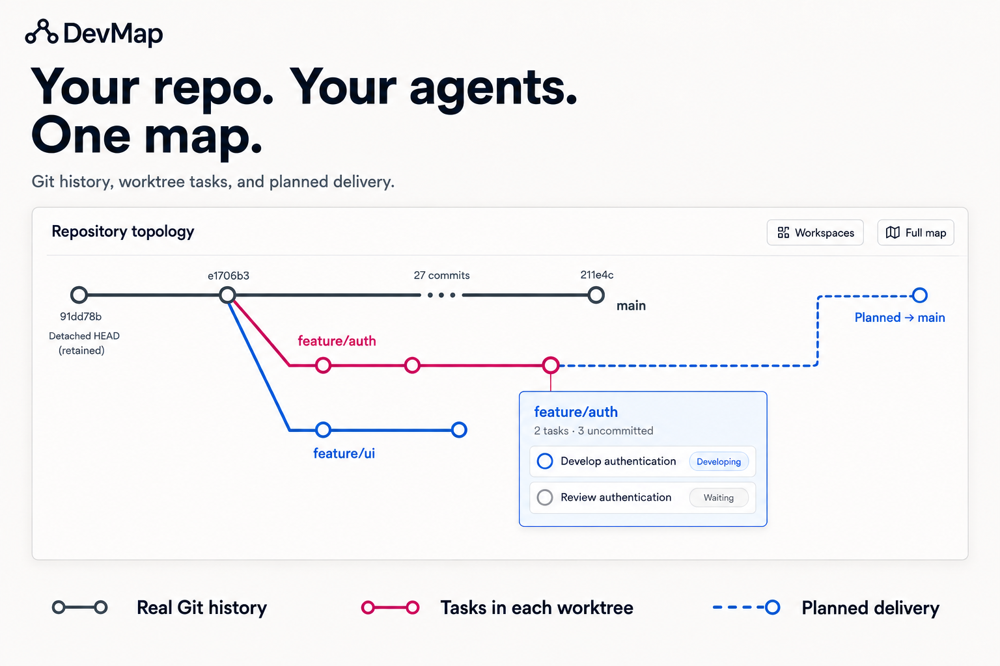

# DevMap



*Illustrated overview of current capabilities. See the actual interface with demo data: [repository map](docs/assets/devmap-ui-reference.jpg) · [workspace tasks](docs/assets/devmap-ui-detail-reference.jpg).*

[简体中文](README.zh-CN.md) · [Quick start](#quick-start) · [Map interactions](#using-the-map) · [Agent interfaces](#agent-interfaces) · [Development](#development)

DevMap is a local Git worktree map for people working with AI Agents. It brings actual commit history, worktree state, associated tasks and recorded delivery plans into one view. Open a workspace summary to understand the work, then open full details when you need the complete task list or Git facts.

This README describes the current `main` implementation. The Rust package is **0.1.0** and remains experimental. The repository also includes a separate context and evidence capture foundation; you can use the map without setting that up.

## What you can do today

| Need | Current behavior |
| --- | --- |
| Understand repository history | Follow actual parent/child edges, forks and merges, with worktrees attached to their observed HEADs. |
| Read long histories | Collapse ordinary commit chains into endpoint hashes and subjects, a three-dot break and a commit count. Expand or collapse the segment in place. |
| Find a workspace | Search the workspace chooser by branch or path, locate the map source, or navigate retained references. |
| Inspect ongoing work | Click a workspace for a compact inline summary; open full details for tasks, working-tree state, integration and publication facts. |
| Follow a delivery plan | See recorded destinations and milestones separately from commit history, including plans to return to `main` or another specified local branch. |
| Find the associated task | Inspect host-supplied task observations and open an exact verified local Codex task when the host supports navigation. |
| Keep context while exploring | Pan, zoom, focus a workspace journey, and trace connections outside the viewport. Ordinary refreshes preserve exploration state. |
| Read facts from an Agent | Use MCP map, context and Agent views rather than extracting facts from pixels. |

## Using the map

### History and planned delivery

**Solid rails describe observed Git history.** Separate tracks and deliberate crossing gaps distinguish a branch transition from a line passing across another line. Fork and merge stations come from retained commit relationships.

**Dashed routes describe recorded intent.** A destination can be `main` or another explicitly specified local branch. The map does not infer a parent branch or a future merge destination from a branch name. Unknown, unavailable and multiple destinations are shown as distinct states. A planned return is never evidence that a merge has happened.

Long ordinary chains with at least four interior commits fold by default. A summary shows the two retained endpoint commits and the number of hidden commits between them. Click the three dots or the summary to expand; use the same summary to collapse. Keyboard activation is supported.

Forks, merges, workspace HEADs, references and tags, explicit history boundaries, and journey anchors stay visible. Navigating to a hidden commit reveals its segment. Parent/child links still point to the real adjacent commits. An expanded range stays expanded across refreshes and an advancing HEAD; folding does not change Git data.

### Workspace details

The compact platform shows workspace identity, observed task counts and a short Git state summary. Selecting it opens one inline summary near the map. **View full details** opens the bottom inspector, which can be resized or collapsed. This keeps the initial view compact while retaining access to tasks and detailed facts.

Use **Workspaces** to search by branch or path, **Locate** to return to the map source, and **Focus journey** to emphasize the selected workspace's route. Zoom, full-map navigation and offscreen connection controls help explore larger repositories. Narrow sidebars use a vertical history direction; wider views use a horizontal one.

### Tasks and observations

A passenger is one observed unarchived chat associated with a worktree, including its Agent. Presence and execution activity are separate: an idle or completed task can still exist in that workspace. Explicitly reported direct collaborators appear under their parent task without adding extra passengers.

Task association uses exact canonical worktree paths, with case-insensitive comparison on Windows. An Agent can also report its verified working directory for its own task; the map labels that association as reported rather than host-authenticated execution telemetry.

Git refresh does not refresh task observations. Missing, stale or partial inventory stays uncertain. Only a complete fresh inventory can establish that a workspace is unattended. Cleanup hints do not delete worktrees or authorize deletion.

## Quick start

You need Git and **Rust 1.96 or newer** to build the CLI.

```sh
git clone https://github.com/DylanZhangzzz/DevMap.git
cd DevMap
cargo install --path .
```

From the repository you want to inspect:

```sh
devmap view --live --source .
```

Open the URL printed by the command. The viewer listens on loopback, uses a private process-lifetime token, and stops when the command stops. Its HTTP routes are read-only. A standalone viewer can inspect Git without a Codex plugin; a complete Codex task roster requires the host to supply task observations.

For terminal output:

```sh
devmap agents --source .
devmap agents --source . --json
```

### In Codex

The plugin package is [plugins/devmap](plugins/devmap/.codex-plugin/plugin.json). It contains one Skill and an MCP configuration that runs `devmap mcp`; ensure the installed `devmap` executable is available to the host through `PATH`.

Register that package in your configured plugin marketplace, then install it using the marketplace's actual name:

```sh
codex plugin add devmap@YOUR_MARKETPLACE
```

`YOUR_MARKETPLACE` is a placeholder, not a public marketplace bundled with this repository. Start a new task after installation or updating the plugin so the host loads the current tools and Skill.

Ask: **“Open DevMap in the right sidebar.”** The Browser surface uses the local viewer. An MCP App surface is also available when supported by the host; embedding and task navigation depend on host capabilities. Updating the source checkout alone does not update an already installed binary or plugin.

## Agent interfaces

The MCP server advertises these six tools:

| Tool | Purpose |
| --- | --- |
| `devmap_open_map` | Open the map as an MCP App or with `surface: browser`. |
| `devmap_read_map` | Read `view: map`, `context` or `agent`; an exact worktree `entity_id` selects Agent context. |
| `devmap_set_route_plan` | Record or revise a worktree's goal, destination, milestones and delivery intent. |
| `devmap_record_requirement` | Record an explicitly supplied approved requirement quotation. |
| `devmap_record_decision` | Record a structured decision and its basis. |
| `devmap_record_evidence` | Record structured evidence metadata. |

Legacy Dock tool names remain compatibility aliases. Route writes use a stable `request_id` and an `expected_revision` to support retries and detect concurrent edits. Plans are local append-only metadata under the Git common directory; they do not create branches or commits.

A delivery agreement can record manual or automatic-merge intent, completion conditions and an authorization source. **DevMap does not execute tests, merge, push, schedule a merge queue or enforce permission.** The executing Agent must verify actual user authorization, its working directory, source and target state, and fresh completion evidence. Recorded intent does not certify merge readiness.

See the [plugin Skill](plugins/devmap/skills/live-worktree-dock/SKILL.md) for task inventory fields, completeness rules, working-directory reports and route update contracts.

## Optional context and capture

DevMap also implements a Common Ground draft and approval flow, an explicit adoption boundary, a separate Git-backed Context Repository, canonical SHA-256 object identities and integrity verification. Project-local Codex, Claude and Generic MCP adapters record supported lifecycle events and structured requirements, decisions and evidence.

To establish context, choose a separate directory from your source repository:

```sh
devmap init --source . --context ../project-context --goal "Adopt DevMap from the current commit" --requirement "docs/requirements.md"
```

Review `bootstrap/common-ground-draft.json` in that context directory, then explicitly approve it:

```sh
devmap common-ground approve --context ../project-context --actor "Your name"
devmap status --context ../project-context
```

Adapter installation is also explicit. Review the plan, then replace the placeholder with its exact digest:

```sh
devmap adapter plan --source . --host codex
devmap adapter install --source . --host codex --plan-digest "sha256-REVIEWED_DIGEST"
devmap adapter verify --source . --host codex
```

Other supported host values are `claude` and `generic-mcp`. Capture journals and local presence live under Git metadata; adapter installation writes the selected project-local configuration. Current adapter capabilities report **Capture Grade D**: configuration and observed events do not imply complete mutation tracking, evidence association or commit mapping. DevMap does not reconstruct decisions from history before adoption.

## Current boundaries

- The operational map covers local worktrees sharing one Git common directory. Cross-machine aggregation is not implemented.
- History, references and task inventories are bounded. Truncation and unavailable ancestry are reported explicitly; collapsed known history is different from missing history.
- Task titles are display data, never instructions. The task roster does not require private conversation transcripts.
- The map and route planner do not modify source Git. Optional context approval and adapter installation are separate write operations.
- PR evidence capsules, enforced merge gates, signed attestations and the broader canonical development topology remain design work, not features of this version.

## Development

Node.js is also needed for the dependency-free renderer and geometry tests.

```sh
cargo fmt --all -- --check
cargo clippy --all-targets --all-features -- -D warnings
cargo test --all-targets -j 1
node --test tests/dock_renderer.cjs tests/metro_core.cjs
cargo build --release
```

The map renderer is in [assets/dock.html](assets/dock.html); geometry and validation are in [assets/metro-core.js](assets/metro-core.js). Rust builds the Git model, serves the viewer and exposes MCP interfaces.

[UI design contract](DESIGN.md) · [History folding verification](docs/audits/2026-09-06-history-folding.md) · [Broader product requirements](docs/ai-development-map-requirements.md)

License declared in [Cargo.toml](Cargo.toml): Apache-2.0.
