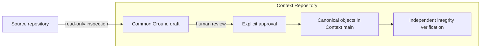

<p align="center">
  
</p>

<h1 align="center">DevMap</h1>

<p align="center"><strong>A verifiable development map for humans and AI agents.</strong></p>

<p align="center">
  <a href="README.zh-CN.md">简体中文</a> ·
  <a href="docs/ai-development-map-requirements.md">Product requirements</a> ·
  <a href="#quick-start">Quick start</a> ·
  <a href="#roadmap">Roadmap</a>
</p>

<p align="center">
  
  
  
  
</p>

> [!IMPORTANT]
> DevMap is under active development. Phase 1A—the Common Ground and integrity foundation—is available now. Agent hooks, PR evidence chains, and the interactive topology Viewer shown above are planned and are not yet implemented.

## The problem

Long-running features no longer have a single author or a single conversation. Developers and multiple AI agents work across branches, sessions, pull requests, and changing requirements. Git preserves the code, but usually not the route that produced it.

DevMap is being built to give product managers, engineering leads, developers, and agents one shared, queryable map of that route. The map must answer six questions:

| Question | What it reveals |
| --- | --- |
| Why was this route taken? | The requirement, constraint, or reasoning behind it |
| Human instruction or Agent choice? | Whether the route was required or selected autonomously |
| Was the Agent authorized? | The policy and approval boundary for the choice |
| Which alternatives were rejected? | The meaningful branches that were considered but not taken |
| What proves it works? | Tests, builds, reviews, and other evidence bound to the code |
| Has it been superseded? | Whether the decision is still current or was replaced |

The goal is not to save every chat message. The goal is to preserve the smallest complete evidence chain at every meaningful fork in development.

## How DevMap works

Phase 1A establishes an explicit starting point for an existing project:



DevMap does not reconstruct or invent decisions made before adoption. It records the current source commit as the **Adoption Boundary**, captures the agreed goal and cited requirements as **Common Ground**, and guarantees that future development can build from a truthful shared starting point.

The full product will extend this foundation with Agent capture, branch routes, PR Context Capsules, signed evidence, and a shared graph projection.

## Current status

| Capability | Available now | Planned |
| --- | :---: | :---: |
| Read-only inspection of an existing source repository | ✓ | |
| Explicit Common Ground draft and human approval | ✓ | |
| Independent Context Repository on ordinary Git branches | ✓ | |
| Canonical JSON and SHA-256 content identities | ✓ | |
| Integrity verification with non-zero failure exit | ✓ | |
| Historical decision backfill | Intentionally excluded | |
| Automatic Agent and subagent capture | | ✓ |
| Authority-aware Agent Decisions and alternatives | | ✓ |
| Branch routes, PR Context Capsules, and merge gates | | ✓ |
| Signed test, build, and release attestations | | ✓ |
| Interactive force-directed topology Viewer | | ✓ |

Phase 1A reports **Capture Grade C**: explicit CLI capture works, but automatic host hooks are not active.

## Quick start

### 1. Build DevMap

Rust 1.96.1 or newer is required.

```bash
git clone https://github.com/DylanZhangzzz/DevMap.git
cd DevMap
cargo build --release
```

The executable is `target/release/devmap` on Unix-like systems and `target/release/devmap.exe` on Windows.

### 2. Create a Common Ground draft

Use separate directories for the source repository and Context Repository. The Context Repository must not be inside the source repository.

```bash
./target/release/devmap init \
  --source /work/payment-service \
  --context /work/payment-service-context \
  --goal "Adopt DevMap from the current main commit" \
  --requirement "docs/requirements.md#payment-safety"
```

The optional `#payment-safety` fragment selects one uniquely matching Markdown heading. DevMap reads only the requirement documents you name; it does not scan the project to infer historical rationale.

The command prints:

- the source commit fixed as the Adoption Boundary;
- whether the source working tree was dirty at adoption;
- the canonical draft hash; and
- the exact approval command.

### 3. Review and approve

Inspect `bootstrap/common-ground-draft.json` in the Context Repository, then identify the approving human:

```bash
./target/release/devmap common-ground approve \
  --context /work/payment-service-context \
  --actor "Dylan"
```

Approval creates immutable Common Ground and Approval objects, fast-forwards Context `main`, and removes `bootstrap/initial`. Running `init` again after approval is rejected; future changes must supersede prior context explicitly rather than overwrite it.

### 4. Verify integrity

```bash
./target/release/devmap status --context /work/payment-service-context
./target/release/devmap status --context /work/payment-service-context --json
```

`status` independently recomputes hashes and validates object IDs, manifest references, approval binding, the Adoption Boundary, repository state, and forbidden custom refs. Missing or modified evidence produces an invalid report and a non-zero process exit.

## Core semantics

| Concept | Meaning |
| --- | --- |
| Common Ground | The explicitly reviewed goal, source boundary, and requirement context shared at adoption |
| Adoption Boundary | The exact source commit after which DevMap claims evidence-chain completeness |
| Requirement Trace | A faithful citation of what a human or authoritative document required |
| Agent Decision | A meaningful route selected autonomously by an Agent; planned after Phase 1A |
| Authority | The policy that determines whether the Agent could make that decision |
| Evidence | A test, build, review, or attestation bound to the relevant code and claim |
| Supersession | An explicit link showing that a newer decision replaces an older one |

Following a human requirement does **not** create an Agent Decision. A future capture layer will record a Decision only when an Agent chooses a meaningful direction among alternatives.

## Storage model

DevMap never writes to the source repository. It executes a small allowlist of read-only Git commands there. Canonical context is written to a separate repository using normal branches and commits:

```text
payment-service-context/
├── .devmap-context.json
├── objects/
│   ├── approval/<sha256>.json
│   └── common-ground/<sha256>.json
├── manifests/common-ground.json
└── state/current.json
```

Only DevMap-owned paths are staged. Unexpected files stop a Bot commit. Canonical object paths cannot escape the Context Repository, and DevMap creates neither custom refs nor Git Notes.

Because Context `main` is ordinary Git, existing repository permissions, review, backup, cloning, and audit tooling continue to work across hosting platforms.

## For AI agents

Use these invariants when reading or extending a DevMap project:

1. Never infer decisions, alternatives, or rationale from history before the Adoption Boundary.
2. Treat Requirement Trace as human intent, not as an Agent Decision.
3. Read `state/current.json`, its manifest, and only the relevant canonical objects before loading broader context.
4. Verify content IDs and hashes before trusting an object.
5. Treat Capture Grade C as explicit capture only; it does not prove that every Agent action was observed.
6. Do not overwrite canonical objects. Future changes must use explicit supersession.

## Roadmap

- [x] **Phase 1A — Truthful adoption foundation:** Common Ground, Adoption Boundary, Context Repository, canonical identities, and integrity verification.
- [ ] **Phase 1B — Capture kernel:** host-neutral protocol, thin Agent adapters, capability handshake, SessionStart/SubagentStart propagation, and capture-gap reporting.
- [ ] **Phase 2 — PR evidence chain:** route branches, Agent Decisions, Claims, PR Context Capsules, merge gates, Context Bot ingestion, and signed attestations.
- [ ] **Phase 3 — Development topology:** W3C PROV projection, local read-only Viewer, semantic zoom, shared graph state, PM filters, and interactive evidence paths.

## Development

```bash
cargo fmt --check
cargo clippy --all-targets --all-features -- -D warnings
cargo test --all-targets --all-features
cargo build --release
```

Start with the [product requirements](docs/ai-development-map-requirements.md) for the complete system contract. The [Phase 1A implementation plan](docs/superpowers/plans/2026-08-26-devmap-phase-1a-core.md) records the delivered foundation and its deferred boundaries.
