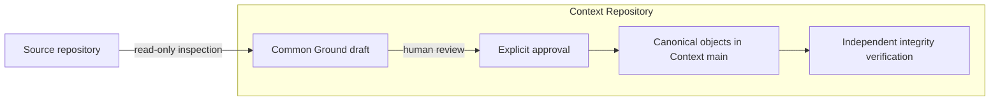

<p align="center">
  
</p>

<h1 align="center">DevMap</h1>

<p align="center"><strong>A verifiable development map for humans and AI agents.</strong></p>

<p align="center">
  <a href="README.zh-CN.md">简体中文</a> ·
  <a href="docs/ai-development-map-requirements.md">Product requirements</a> ·
  <a href="#quick-start">Quick start</a> ·
  <a href="#roadmap">Roadmap</a>
</p>

<p align="center">
  
  
  
  
</p>

> [!IMPORTANT]
> DevMap is under active development. Phase 1A provides the Common Ground and integrity foundation; Phase 1B adds local Codex and Claude hooks plus a Generic MCP capture endpoint. The Live Worktree Dock MVP adds a read-only local view of worktrees and instrumented Agents. Source Git workflow automation, PR evidence chains, and the full interactive topology Viewer shown above are not yet implemented.

## The problem

Long-running features no longer have a single author or a single conversation. Developers and multiple AI agents work across branches, sessions, pull requests, and changing requirements. Git preserves the code, but usually not the route that produced it.

DevMap is being built to give product managers, engineering leads, developers, and agents one shared, queryable map of that route. The map must answer six questions:

| Question | What it reveals |
| --- | --- |
| Why was this route taken? | The requirement, constraint, or reasoning behind it |
| Human instruction or Agent choice? | Whether the route was required or selected autonomously |
| Was the Agent authorized? | The policy and approval boundary for the choice |
| Which alternatives were rejected? | The meaningful branches that were considered but not taken |
| What proves it works? | Tests, builds, reviews, and other evidence bound to the code |
| Has it been superseded? | Whether the decision is still current or was replaced |

The goal is not to save every chat message. The goal is to preserve the smallest complete evidence chain at every meaningful fork in development.

## How DevMap works

Phase 1A establishes an explicit starting point for an existing project:



DevMap does not reconstruct or invent decisions made before adoption. It records the current source commit as the **Adoption Boundary**, captures the agreed goal and cited requirements as **Common Ground**, and guarantees that future development can build from a truthful shared starting point.

The full product will extend this foundation with branch routes, PR Context Capsules, signed evidence, and a shared graph projection.

Phase 1B now captures structured lifecycle and semantic events in an append-only journal under the resolved Git directory for each worktree. Thin Codex and Claude adapters normalize native lifecycle/activity into the shared event and journal contract; Generic hosts use the local stdio MCP endpoint and shared Capture Kernel for explicit semantic entries. Full prompt transcripts are not stored by native hooks.

## Current status

| Capability | Available now | Planned |
| --- | :---: | :---: |
| Read-only inspection of an existing source repository | ✓ | |
| Explicit Common Ground draft and human approval | ✓ | |
| Independent Context Repository on ordinary Git branches | ✓ | |
| Canonical JSON and SHA-256 content identities | ✓ | |
| Integrity verification with non-zero failure exit | ✓ | |
| Project-local Codex and Claude capture adapters | ✓ | |
| Generic MCP stdio capture endpoint | ✓ | |
| Historical decision backfill | Intentionally excluded | |
| Native Agent and subagent lifecycle capture | ✓ | |
| Explicit structured Agent Decisions and alternatives | ✓ | |
| Live local worktree and Agent Dock | ✓ | |
| Zero-manual-start Codex MCP App package | ✓ | |
| Branch routes, PR Context Capsules, and merge gates | | ✓ |
| Signed test, build, and release attestations | | ✓ |
| Interactive force-directed topology Viewer | | ✓ |

Capture Grade is derived from runtime-verifiable capabilities, not the adapter name or a literal in its configuration. Codex hooks, Claude hooks, and Generic MCP currently report an effective **D**, including when their configuration is exact, because Phase 1B does not yet observe mutation state, associate evidence with mutations, or map records to commits. Configuration and effective activation are reported separately.

## Quick start

### 1. Build DevMap

Rust 1.96.1 or newer is required.

```bash
git clone https://github.com/DylanZhangzzz/DevMap.git
cd DevMap
cargo build --release
```

The executable is `target/release/devmap` on Unix-like systems and `target/release/devmap.exe` on Windows.

### 2. Create a Common Ground draft

Use separate directories for the source repository and Context Repository. The Context Repository must not be inside the source repository.

```bash
./target/release/devmap init \
  --source /work/payment-service \
  --context /work/payment-service-context \
  --goal "Adopt DevMap from the current main commit" \
  --requirement "docs/requirements.md#payment-safety"
```

The optional `#payment-safety` fragment selects one uniquely matching Markdown heading. DevMap reads only the requirement documents you name; it does not scan the project to infer historical rationale.

The command prints:

- the source commit fixed as the Adoption Boundary;
- whether the source working tree was dirty at adoption;
- the canonical draft hash; and
- the exact approval command.

### 3. Review and approve

Inspect `bootstrap/common-ground-draft.json` in the Context Repository, then identify the approving human:

```bash
./target/release/devmap common-ground approve \
  --context /work/payment-service-context \
  --actor "Dylan"
```

Approval creates immutable Common Ground and Approval objects, fast-forwards Context `main`, and removes `bootstrap/initial`. Running `init` again after approval is rejected; future changes must supersede prior context explicitly rather than overwrite it.

### 4. Verify integrity

```bash
./target/release/devmap status --context /work/payment-service-context
./target/release/devmap status --context /work/payment-service-context --json
```

`status` independently recomputes hashes and validates object IDs, manifest references, approval binding, the Adoption Boundary, repository state, and forbidden custom refs. Missing or modified evidence produces an invalid report and a non-zero process exit.

### 5. Enable and operate local capture

Always preview the exact project-local change first. Replace the host with `claude` or `generic-mcp` as needed:

```bash
./target/release/devmap adapter plan --source /work/payment-service --host codex
```

Review the printed bindings, destination, and `plan_digest` before installing. The digest approves the exact host, action, source identity, prior bytes/file identity, and proposed result; any intervening edit requires a new plan. Native installs change only `.codex/hooks.json` or `.claude/settings.json`; Generic MCP changes only `.devmap/mcp.json`.

```bash
./target/release/devmap adapter install --source /work/payment-service --host codex \
  --plan-digest 'sha256-<reviewed-digest>'
./target/release/devmap adapter verify --source /work/payment-service --host codex
```

After installation, inspect the resulting configuration and complete any trust or review step required by the host before opening a capture session. DevMap does not bypass host trust controls. `adapter verify` reports configuration drift separately from effective activation; executable reachability, native-host trust or managed-policy permission, and Generic MCP host registration remain explicit unresolved activation reasons when they cannot be verified. Omitting `--host` verifies Codex, Claude, and Generic MCP together.

For a Generic MCP host, `.devmap/mcp.json` is the descriptor to review and register. It starts `devmap mcp --source .` over stdio. Modern discovery advertises only `2026-07-28`; the legacy `2025-11-25` version remains available only through initialize negotiation, including the required successful counteroffer for another legacy version.

Codex hooks, Claude hooks, and Generic MCP all currently have an honest effective Capture Grade D. Native hooks provide bounded lifecycle and activity signals: `Stop` means turn completion, while only `SessionEnd` means session completion. A write-capable tool produces tool activity plus a `mutation_unverified` gap, never a guessed mutation. Explicit Requirement, Decision, and Evidence records use the shared MCP/Capture Kernel surface. Grade A remains unavailable until mutation state, evidence association, and commit mapping are runtime-observable.

Capture journals are local to each worktree at:

```text
<git rev-parse --git-dir>/devmap/sessions/<session-id>/events.ndjson
```

They are append-only local evidence and are not staged in the source repository. To remove only DevMap-owned bindings or the exact Generic descriptor, review a removal plan and pass its separate digest:

```bash
./target/release/devmap adapter plan --source /work/payment-service --host codex --action uninstall
./target/release/devmap adapter uninstall --source /work/payment-service --host codex \
  --plan-digest 'sha256-<reviewed-removal-digest>'
```

Phase 1B observes and records; it does **not** create or switch branches or worktrees, stage files, commit, stash, configure remotes, or push. Source Git workflow management begins in a later phase.

### 6. Open the Live Worktree Dock in Codex

One-time setup installs the executable and enables the repository plugin package at `plugins/devmap`:

```bash
cargo install --path .
```

After the plugin is installed and enabled, ask Codex to “Show the DevMap Worktree Dock.” Codex launches `devmap mcp` as a host-managed STDIO process and opens the MCP App in its side pane. Normal use does not require a local HTTP server or a separate `devmap view --live` process.

The Dock is deliberately local: it shows worktrees sharing the current repository's Git common directory and Presence emitted by enabled adapters. Installation is one-time, while runtime startup and shutdown follow the Codex task. Project trust settings or managed MCP policy can disable the plugin; DevMap must report that limitation rather than claim the Dock is active.

For environments without MCP Apps, `devmap view --live --source PATH` is an optional, temporary Browser fallback. It binds only to loopback and stops with the command; it is not required by the Codex plugin path.

The same bounded read model is also available without a UI:

```bash
devmap agents --source /work/payment-service --json
devmap view --live --source /work/payment-service
```

The second command prints one authenticated loopback URL. Keep that URL private: its 256-bit token exists only for that process lifetime. The fallback accepts only `GET`, stores no token, and exposes no mutation endpoint.

Ephemeral Presence is shared by linked worktrees under `<git rev-parse --git-common-dir>/devmap/presence/v1/`; capture journals remain isolated under each worktree's Git directory. `starting`, `working`, `waiting`, and `idle` are live states; `completed` requires an observed `SessionEnd`; `stale` means a lease expired; and `unknown` means Git knows the worktree but no valid Presence record describes an Agent. `CAPTURE INCOMPLETE`, `PRESENCE INCOMPLETE`, and partial-view banners are integrity signals, not proof that work failed.

This MVP is a local operational Dock, not yet the canonical development topology. It does not reconstruct routes, synchronize across machines, write the Context Repository, or replace the planned PR/Release evidence graph.

## Core semantics

| Concept | Meaning |
| --- | --- |
| Common Ground | The explicitly reviewed goal, source boundary, and requirement context shared at adoption |
| Adoption Boundary | The exact source commit after which DevMap claims evidence-chain completeness |
| Requirement Trace | A faithful citation of what a human or authoritative document required |
| Agent Decision | A meaningful route selected autonomously by an Agent, with basis, alternatives, rationale, authority, scope, and a revisit trigger |
| Authority | The policy that determines whether the Agent could make that decision |
| Evidence | A test, build, review, or attestation bound to the relevant code and claim |
| Supersession | An explicit link showing that a newer decision replaces an older one |

Following a human requirement does **not** create an Agent Decision. The Phase 1B kernel records a Decision only from an explicit structured call for an Agent choice among meaningful alternatives; observing a mutation never fabricates one.

## Storage model

Except for an explicitly selected project-local adapter file (`.codex/hooks.json`, `.claude/settings.json`, or `.devmap/mcp.json`), Phase 1B does not write the source worktree or mutate source Git state. Capture journals live under the resolved per-worktree Git directory. Canonical Phase 1A context is written to a separate repository using normal branches and commits:

```text
payment-service-context/
├── .devmap-context.json
├── objects/
│   ├── approval/<sha256>.json
│   └── common-ground/<sha256>.json
├── manifests/common-ground.json
└── state/current.json
```

Only DevMap-owned paths are staged. Unexpected files stop a Bot commit. Canonical object paths cannot escape the Context Repository, and DevMap creates neither custom refs nor Git Notes.

Because Context `main` is ordinary Git, existing repository permissions, review, backup, cloning, and audit tooling continue to work across hosting platforms.

## For AI agents

Use these invariants when reading or extending a DevMap project:

1. Never infer decisions, alternatives, or rationale from history before the Adoption Boundary.
2. Treat Requirement Trace as human intent, not as an Agent Decision.
3. Read `state/current.json`, its manifest, and only the relevant canonical objects before loading broader context.
4. Verify content IDs and hashes before trusting an object.
5. Treat Capture Grade as capability-derived coverage. Phase 1B native hooks and Generic MCP are Grade D even when configured exactly; configuration, activation, and capability grade are separate facts. A higher grade requires runtime-verifiable mutation, evidence, and commit-mapping capabilities.
6. Do not overwrite canonical objects. Future changes must use explicit supersession.

## Roadmap

- [x] **Phase 1A — Truthful adoption foundation:** Common Ground, Adoption Boundary, Context Repository, canonical identities, and integrity verification.
- [x] **Phase 1B — Capture kernel:** host-neutral protocol, thin Agent adapters, capability handshake, SessionStart/SubagentStart propagation, and capture-gap reporting.
- [ ] **Phase 2 — PR evidence chain:** route branches, Agent Decisions, Claims, PR Context Capsules, merge gates, Context Bot ingestion, and signed attestations.
- [ ] **Phase 3 — Development topology:** W3C PROV projection, local read-only Viewer, semantic zoom, shared graph state, PM filters, and interactive evidence paths.

## Development

```bash
cargo fmt --check
cargo clippy --all-targets --all-features -- -D warnings
cargo test --all-targets --all-features
cargo build --release
```

Start with the [product requirements](docs/ai-development-map-requirements.md) for the complete system contract. The [Phase 1A implementation plan](docs/superpowers/plans/2026-08-26-devmap-phase-1a-core.md) and [Phase 1B implementation plan](docs/superpowers/plans/2026-08-27-devmap-phase-1b-native-capture.md) record the delivered foundation and its deferred boundaries.
