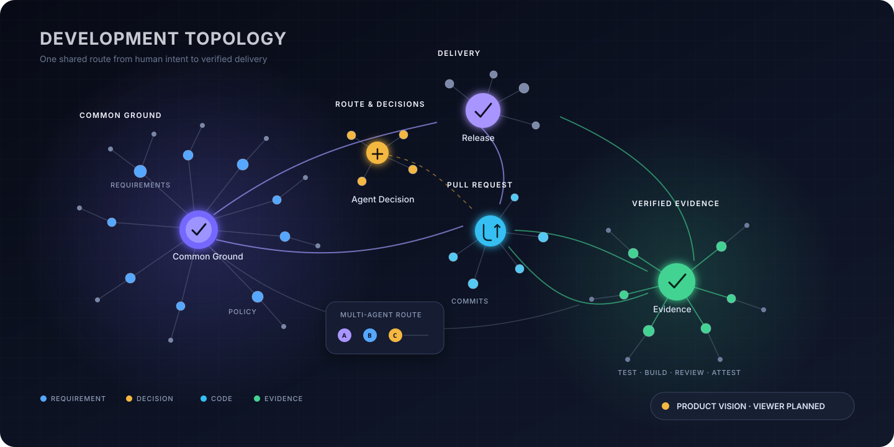
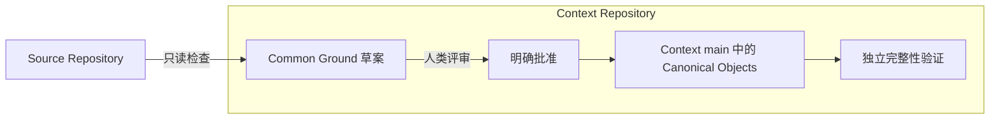

<p align="center">
  
</p>

<h1 align="center">DevMap</h1>

<p align="center"><strong>供人类与 AI Agent 共同使用的、可验证的开发地图。</strong></p>

<p align="center">
  <a href="README.md">English</a> ·
  <a href="docs/ai-development-map-requirements.md">产品需求</a> ·
  <a href="#快速开始">快速开始</a> ·
  <a href="#路线图">路线图</a>
</p>

<p align="center">
  
  
  
  
</p>

> [!IMPORTANT]
> DevMap 正在积极开发中。目前已经交付 Phase 1A——Common Ground 与完整性基础。上图中的 Agent Hooks、PR 证据链和交互式拓扑 Viewer 仍在规划中，尚未实现。

## 问题背景

大型长期功能不再只有一个作者，也不再只存在于一次对话中。开发者和多个 AI Agent 会跨分支、Session、Pull Request 与持续变化的需求并行工作。Git 保存了代码，却通常没有保存代码形成的路线。

DevMap 的目标，是为 PM、研发负责人、开发者和 Agent 提供一张统一、可查询的开发地图。这张地图必须回答六个问题：

| 问题 | 它揭示什么 |
| --- | --- |
| 为什么走这条路线？ | 背后的需求、约束或推理 |
| 这是人类指令还是 Agent 自主选择？ | 路线是被要求的，还是自主选择的 |
| Agent 是否有权做这个决定？ | 该选择对应的权限策略与批准边界 |
| 哪些方案被放弃？ | 曾被认真考虑但没有采用的岔路 |
| 哪项证据证明它有效？ | 与代码绑定的测试、构建、评审和其他证据 |
| 这个决定是否已经被替代？ | 该决定当前是否仍然有效 |

目标不是保存每一句聊天，而是在每个有意义的开发岔路口，保存最小但完整的证据链。

## DevMap 如何工作

Phase 1A 为已有项目建立明确的共同起点：



DevMap 不会回溯重建或猜测接入前的历史决策。它把当前源码 commit 记录为 **Adoption Boundary**，把共同目标和明确引用的需求记录为 **Common Ground**，保证后续开发可以从真实、统一的起点继续。

完整产品将在这个基础上加入 Agent 捕获、分支路线、PR Context Capsule、签名证据和共享图谱投影。

## 当前状态

| 能力 | 当前可用 | 规划中 |
| --- | :---: | :---: |
| 只读检查已有源码仓库 | ✓ | |
| Common Ground 草案和人类明确批准 | ✓ | |
| 使用普通 Git 分支的独立 Context Repository | ✓ | |
| Canonical JSON 与 SHA-256 内容标识 | ✓ | |
| 完整性验证和非零失败退出码 | ✓ | |
| 历史决策回填 | 明确排除 | |
| Agent 与 Subagent 自动捕获 | | ✓ |
| 带权限判断的 Agent Decision 与备选方案 | | ✓ |
| 分支路线、PR Context Capsule 和 Merge Gate | | ✓ |
| 测试、构建和发布签名证明 | | ✓ |
| 交互式力导向拓扑 Viewer | | ✓ |

Phase 1A 的 **Capture Grade 为 C**：显式 CLI 捕获可用，但自动宿主 Hooks 尚未启用。

## 快速开始

### 1. 构建 DevMap

需要 Rust 1.96.1 或更高版本。

```bash
git clone https://github.com/DylanZhangzzz/DevMap.git
cd DevMap
cargo build --release
```

Unix 类系统的可执行文件是 `target/release/devmap`，Windows 下是 `target/release/devmap.exe`。

### 2. 创建 Common Ground 草案

源码仓库和 Context Repository 必须使用不同目录，Context Repository 不能位于源码仓库内部。

```bash
./target/release/devmap init \
  --source /work/payment-service \
  --context /work/payment-service-context \
  --goal "从当前 main commit 开始接入 DevMap" \
  --requirement "docs/requirements.md#payment-safety"
```

可选的 `#payment-safety` 片段会选择唯一匹配的 Markdown 标题。DevMap 只读取你明确指定的需求文档，不会扫描项目并猜测历史理由。

命令会输出：

- 作为 Adoption Boundary 的源码 commit；
- 接入时源码工作树是否存在未提交修改；
- Canonical 草案哈希；
- 完整的批准命令。

### 3. 评审并批准

先检查 Context Repository 中的 `bootstrap/common-ground-draft.json`，然后填写批准人的身份：

```bash
./target/release/devmap common-ground approve \
  --context /work/payment-service-context \
  --actor "Dylan"
```

批准会生成不可变的 Common Ground 与 Approval 对象，将 Context `main` fast-forward，并删除 `bootstrap/initial`。批准后再次运行 `init` 会被拒绝；未来变更必须明确 supersede 旧上下文，不能直接覆盖。

### 4. 验证完整性

```bash
./target/release/devmap status --context /work/payment-service-context
./target/release/devmap status --context /work/payment-service-context --json
```

`status` 会独立重算哈希，并验证对象 ID、Manifest 引用、Approval 绑定、Adoption Boundary、仓库状态和禁止出现的自定义 refs。证据缺失或被修改时，命令会输出 invalid 报告并返回非零退出码。

## 核心语义

| 概念 | 含义 |
| --- | --- |
| Common Ground | 接入时经过明确评审的目标、源码边界与需求上下文 |
| Adoption Boundary | DevMap 从哪个精确源码 commit 之后开始保证证据链完整 |
| Requirement Trace | 对人类或权威文档要求的如实引用 |
| Agent Decision | Agent 自主选择的一条有意义路线；Phase 1A 之后实现 |
| Authority | 判断 Agent 是否有权作出该决定的策略 |
| Evidence | 与相关代码和 Claim 绑定的测试、构建、评审或证明 |
| Supersession | 明确表示新决定替代旧决定的关系 |

Agent 按照人类要求执行时，**不会**创建 Agent Decision。未来捕获层只在 Agent 面对多个方向并自主选择有意义路线时记录 Decision。

## 存储模型

DevMap 永远不会写入源码仓库，只会在其中执行一组很小的只读 Git 命令。Canonical Context 保存在独立仓库中，使用普通分支和 commit：

```text
payment-service-context/
├── .devmap-context.json
├── objects/
│   ├── approval/<sha256>.json
│   └── common-ground/<sha256>.json
├── manifests/common-ground.json
└── state/current.json
```

DevMap 只暂存自己的路径；发现意外文件时 Bot commit 会停止。Canonical Object 路径不能越出 Context Repository，并且系统不会创建 custom refs 或 Git Notes。

因为 Context `main` 是普通 Git，现有仓库权限、评审、备份、克隆和审计工具可以继续跨平台使用。

## 给 AI Agent 的读取规则

读取或扩展 DevMap 项目时遵循以下不变量：

1. 不得根据 Adoption Boundary 之前的历史推测决策、备选方案或理由。
2. Requirement Trace 表示人类意图，不是 Agent Decision。
3. 先读取 `state/current.json`、对应 Manifest 和相关 Canonical Objects，再决定是否加载更大上下文。
4. 信任对象前必须验证内容 ID 和哈希。
5. Capture Grade C 只代表显式捕获，不证明所有 Agent 活动都已被观察。
6. 不得覆盖 Canonical Objects；未来变更必须明确建立 supersession。

## 路线图

- [x] **Phase 1A — 真实接入基础：** Common Ground、Adoption Boundary、Context Repository、Canonical ID 和完整性验证。
- [ ] **Phase 1B — Capture Kernel：** 宿主中立协议、薄 Agent Adapter、Capability Handshake、SessionStart/SubagentStart 传播和 Capture Gap 报告。
- [ ] **Phase 2 — PR 证据链：** Route Branch、Agent Decision、Claim、PR Context Capsule、Merge Gate、Context Bot 接入和签名证明。
- [ ] **Phase 3 — 开发拓扑：** W3C PROV 投影、本地只读 Viewer、语义缩放、共享 Graph State、PM 过滤器和交互式证据路径。

## 开发

```bash
cargo fmt --check
cargo clippy --all-targets --all-features -- -D warnings
cargo test --all-targets --all-features
cargo build --release
```

完整系统契约请阅读[产品需求文档](docs/ai-development-map-requirements.md)。[Phase 1A 实施计划](docs/superpowers/plans/2026-08-26-devmap-phase-1a-core.md)记录了当前已交付基础与明确延期边界。
