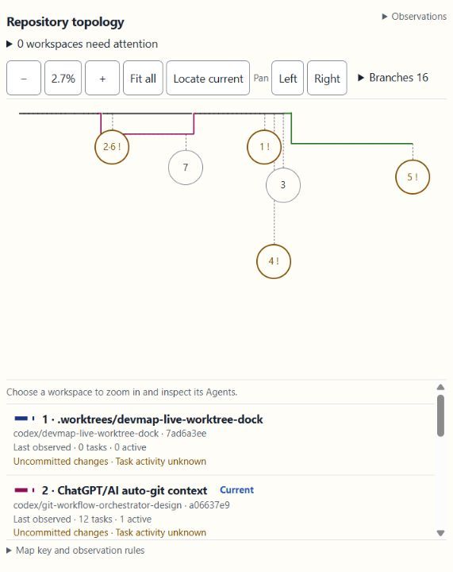
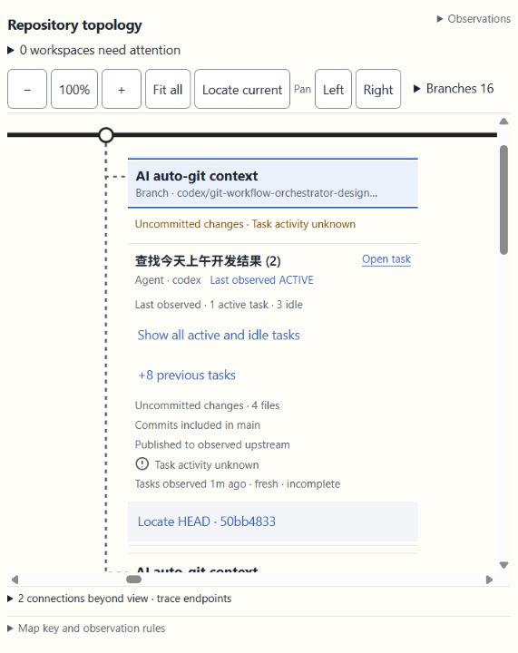

# DevMap map zoom — bounded acceptance

Date: 2026-09-05. Scope: the user-approved overview/detail zoom interaction, not a release, merge, plugin installation, or completion of the wider automation goal.

## Delivered behavior

- Initial v4 view fits the observed topology. Map-only − / percentage (reset to 100%) / + / Fit all / Locate current controls remain unscaled.
- Below 60%, verbose map labels are hidden. Normal-size workspace summaries retain exact checkout identity, task counts, last-observed qualifiers, uncommitted changes, and target-inclusion warnings.
- Numbered map locations correspond to the workspace list. Shared HEADs share one location marker; individual workspace rows still select their exact checkout. Crowded markers can be omitted from the drawing, never from the list.
- Selecting a workspace zooms to 100% and visibly selects its identity, without opening an Agent/task. Selection, scale and pan survive observation/geometry refresh. Keyboard zoom is scoped to the map; Ctrl/Meta browser shortcuts and nested controls are not intercepted. Empty-space drag supports both axes.
- Scale-compensated SVG strokes retain visible routes and crossing gaps. The underlying commit DAG, branch colors and attention classifier are unchanged.
- Compatibility snapshots remain explicitly limited; invalid snapshots keep the last valid view. No system animation setting changed.

## Evidence

- Node: 120 passing tests, including eight new zoom contracts and an immediate-selection assertion. New behavior was first observed failing, then implemented. Existing framing/wayfinding tests now explicitly enter detail mode rather than assuming it on first load.
- Rust: full `cargo test --all-targets --quiet` passed 252 tests during this turn. After the final HTML edits, `cargo test --test dock_ui_contract --test dock_viewer --quiet` passed all 19 tests. `cargo build --quiet` and `git diff --check` passed.
- Browser inspection at 360×720 and 571×720: no document-level horizontal overflow, 14px zoom controls and overview text, 44×44px markers, exact workspace drill-down, preserved risk text. The 1280px check exposed the original near-invisible scaled strokes; corrected before final delivery.
- Final 1280×720 confirmation: viewport and scroll extent both 1248×353, no body overflow, 14px summary text. Live refresh retained scale 0.7142857142857143, left 2980, top 42.400001525878906 and the same exact selected workspace ID. Both the workspace container and identity control reflect that same selection after rendering. No browser console errors were observed. Temporary viewport overrides were reset.
- Final candidate: PID 40516; executable fingerprint begins `bb2bff823b73`. Served HTML equals assembled source, SHA256 `d6fa370e2d14ed969ec84edd6f369f37b33a3d2300fe79216e9c2a8d50117106`.
- See [final process/source provenance](2026-09-05-devmap-map-zoom-final-provenance.json). It records all compiled source inputs and the actual executable path, without an authenticated URL.
- The 131,041-byte asset remains below the unchanged 131,072-byte limit. Scoped `.gitattributes` rules pin both embedded assets to LF so Windows checkout conversion cannot silently exceed the limit. Only 31 bytes of budget remain: future UI additions need an explicit size-reduction pass, not a raised limit.

[360px overview](../../.impeccable/review/zoom-final-overview-360.png) · [1280px overview](../../.impeccable/review/zoom-final-overview-1280.png)

## Preserved boundaries

Open task was not changed. Seven relevant function blocks (`directTaskUrl`, `createTask`, `requestTaskNavigation`, `finishTaskNavigationRequest`, `graphLink`, `showTask`, `showDetails`) were compared against the pre-morning-patch running asset and matched exactly. No native task link was activated during this zoom QA; browser automation is not evidence of native task arrival/return.

Before each development candidate opened, its actual worktree snapshot was read and a fresh public task listing supplied. The final listing associates 13 local tasks with seven checkouts. The host returned 50 rows before filtering, so completeness remains false. No private Codex storage or transcripts were used.

Impeccable informed the readable overview/detail split and the bounded browser inspection. This does not repeat or extend the previous independent review score. The running candidate is development-only; installed MCP binaries, Git branches/remotes and OS preferences were not changed.
