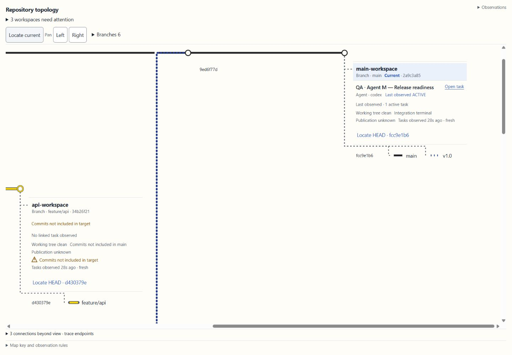
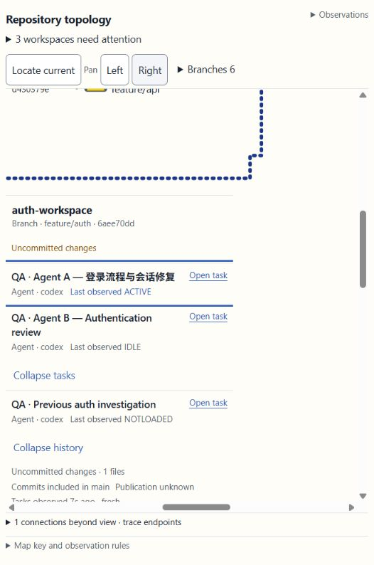
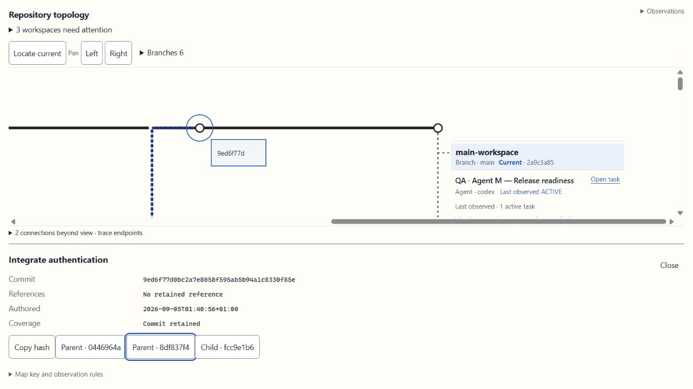

# DevMap Metro 候选版验收记录

后续增量：用户批准的地图缩放功能已另行实现，见 [缩放验收与最终候选指纹](2026-09-05-devmap-map-zoom.md)。下文的页面整体 SHA 和截图是缩放前记录；Open task 的恢复行为继续保留，未随缩放修改。此增量不代表完整 goal、发布或安装验收。

日期：2026-09-05。最新状态：**已按用户要求撤回早上的 Open task 反馈及复制链接补丁**。用户明确将问题归因于虚拟鼠标，要求恢复修改前版本；不再把自动化点击受限当作用户点击失效或已证实的宿主故障。右侧显示已有用户确认，完整跳转及返回仍没有本轮新的人工验收证据；系统动画设置不变。本记录不代表发布、合并或本地安装升级。

历史排查见 [Open task 排查与撤回记录](2026-09-05-devmap-open-task-regression.md)。新增反馈、Task link 详情字段、Copy task link 按钮及对应测试已精确撤回，原有 Copy task ID 保留。页面源码SHA256恢复为 `4920e6254a952fd5405c927176a455930bba75f81a4e04f3b0e9aff4a5d4a3f8`，与早上补丁前构建清单一致。该补丁从未部署到右侧运行版，因此没有重装或替换运行进程。

## 已验证

- 真实 Branch/Commit 父子关系、同一 commit 的多引用、独立 Workspace 身份与精确 HEAD；不把工作目录画成分支，也不虚构 merge 事件。
- 一个 Workspace 下保留多个任务，显示各自状态；展开历史任务，每个已验证任务都有明确的 Open task 入口。未验证身份仅可检查。
- 未提交修改、是否已包含在目标分支、发布状态和任务观察新鲜度独立显示。过期或不完整清单不用于断言无人工作。
- 360、480、526、900、1440 CSS px 复拍；当前站点、Workspace 和任务可见。任务名称14px、Workspace 名称15px、元数据12px。200% 等效文字放大保留完整任务名称与入口。
- 12 条真实测试图连线的端点误差小于0.001 CSS px；未测到轨道与 Workspace/引用/提交标签碰撞；8处交叉遮罩保留。
- 同视角前两条轨道间距由580px降至383px，1440×1000可同时看到两个完整 Workspace 组。400条展开任务保留并可原生滚动到最后一条。
- 无效快照保留上一张有效图；恢复后清除拒绝消息。显式任务清单更新同时到达数据工具与已运行的 Viewer，实际 HTTP 观察时间一致。
- Impeccable 独立复核：两项指定界面问题均 resolved，disposition: ship **仅针对这两项整改**，不是整体验收证明。

截图中的 QA 任务为明确标识的测试数据，不证明原生任务跳转。真实仓库另外识别7个Workspace、13个本地关联任务；公共清单达到50项返回上限，因此 complete=false。当前任务归属调用任务的实际工作目录，而不是执行开发命令的目录。

## 自动化结果及未关闭项

| 检查 | 结果 |
| --- | --- |
| Node 行为测试 | 控制器独立重跑112通过，0失败 |
| Rust 全量 cargo test --all-targets -j1 | 控制器完整重跑252通过，0失败，exit 0；不再有提前结束后的补跑替代 |
| 大规模数据契约 | 原失败已复现并修正：检查权威lanes/facts，保留100个Workspace、1,000条Presence记录、当前10条精确session身份；仍限制1秒与768 KiB，未改后端预算策略或虚构host任务清单 |
| fmt / clippy所有目标和特性 / git diff --check | 通过；Git仅提示现有LF→CRLF换行转换 |
| Release长期性能 | 最终追加构建重跑通过：1065条记录，预载17616ms，64次采样总1129ms，p95 27ms，native hook374ms，均在既定限额内 |
| 最终代码复核 | 原4项重要问题及端点焦点遗留均解决；追加独立复核Approved，无Critical/Important。仅有可选测试增强建议：显式断言Presence-only样例的counts.tasks=0；未判定为功能缺陷 |
| 新构建焦点实测 | 第二个Parent端点8df837f4在年龄tick与接收新快照后保持同一完整OID，视口left=1151.199951171875、top=0未改变；消失端点不错误转移的负例由回归测试覆盖 |
| 真实任务跳转及返回 | **保留人工证据，不作自动化故障归因**：用户此前报告“可以跳转”，最新指出虚拟鼠标问题并要求回退。已恢复原有行为；本轮未重新触发任务跳转，也不把回退或单元测试当作原生到达及返回证明 |
| 右侧原生面板可见性 | **通过（用户手动证据）**：用户针对“新版DevMap是否在右侧显示”明确回复“是的”；已补足此前queued回执不能证明的实际显示 |
| 系统减少动态效果 | 源码和测试覆盖该分支；当前实际 matchMedia 为 false。用户明确暂不修改系统设置，保留未验证状态，不继续要求更改 |

此前按Subagent-Driven Development终审上限暂停；用户随后要求继续，完成了测试契约与焦点两项修复及一次独立复核。该轮只改3个允许文件，CSS与metro-core未改变；原Impeccable结论仅适用于其已评分范围。随后的 Open task 恢复补丁现已按用户指示撤回，不再据自动点击限制要求修复宿主。源代码检查不能替代真实宿主交接，仍不将goal标为完成。

该截图为真实Git测试仓库和明确标注的合成任务；只证明检查器交互，不证明原生任务跳转。

## 可复核构建身份

- 工作目录：`C:/Users/user/Documents/ChatGPT/DevMap-phase-1a-worktree`
- 分支：`codex/rail-view-design-alignment`；HEAD `5741c330c457331065d76dc884ff5b0ea8a2c2f0`，包含未提交修改，Git index为空。
- 实际候选进程PID21492；路径在该工作目录的 `.superpowers/sdd/2026-09-04-devmap-metro-topology/runtime-qa-5852dfe116f8/devmap.exe`。旧的自建候选进程已退出，用户原有preview未停止。
- 可执行文件SHA256：`5852dfe116f84775649a627ef724c892825748a85d6f56d1a8315028df4622db`。
- 已记录运行构建的HTML为119162字节，SHA256：`43acfe2e59c406ee12397de4df3e314d6ea8d0bbf0729aeace5b5e707740c7da`，与当时指纹清单一致；模型schema `devmap/dock/4`。本次已将页面源码精确恢复为该构建清单中的哈希；没有重新部署或冒称新的运行验证。
- 页面标题 `DevMap · Rail View — Repository topology`，主标题 `Repository topology`；页面包含 `DevMap · Rail View`。
- [最终源文件/运行时指纹清单](2026-09-05-devmap-metro-followon-provenance.json)。[前一候选历史证据](2026-09-05-devmap-metro-candidate-provenance.json)保留，不混作最终构建；均不包含认证URL或token。

代码、既有用户修改、审查快照均保留。未stage、commit、push、merge、重新安装全局skill或删除工作树。

[实际设计规范](../../DESIGN.md)与[组件设计sidecar](../../.impeccable/design.json)已写入并校验。文档子任务重复执行了一次Impeccable context读取，这是流程偏差；没有再次运行detector、重开设计方向或修改配置/源代码。

## 用户端最后确认

1. **右侧显示已确认**：用户回复“是的”。主标题的既有浏览器验证仍单独保留，不额外扩大本次用户反馈范围。
2. **Open task已按用户要求回退**：最新指示为“是你的虚拟鼠标问题，把这部分改回到早上修改前的上一个版本”。已执行；不把虚拟鼠标验证结果直接认定为产品故障，也不要求重复失败探测。
3. **减少动态效果暂缓**：用户明确“暂不修改系统设置”，不改系统也不冒充通过。

历史上已核对27个构建输入、PID21492及HTTP资源，并因三轮缺少手动证据将goal标为受阻。最新任务是用户明确要求的局部回退，已完成源码及测试的恢复；未更改链接目标、宿主配置、系统设置或Git状态。缩放功能仍只有待确认方案，未混入本次回退；自动Git调度不属于本次实施范围。
