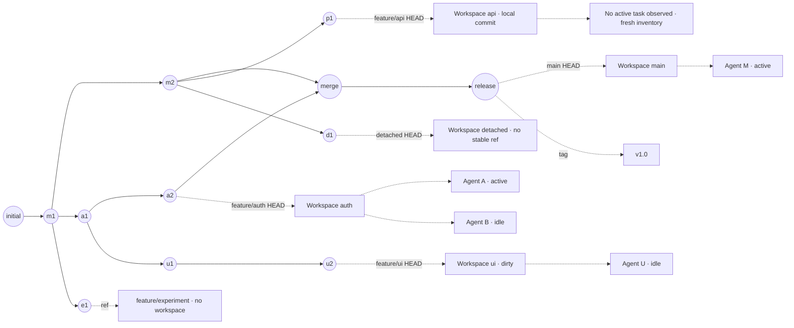

# DevMap Metro Topology — Development Specification

Date: 2026-09-04

Status: development preparation complete; the third visual direction and connection corrections are user-approved. Implementation and release acceptance remain open.

## Authority and scope

The user selected concept 3, approved parallel branch lanes with workspace stations and multiple Agents, and requested London Underground-inspired line colors. The latest correction requires every visible branch origin and integration destination to be traceable.

The selected image is authoritative for the light palette, station treatment and operational hierarchy. Its disconnected lower rails, floating merge arrows, branch-color changes, contradictory sample statuses and duplicated inspector content are explicitly rejected defects. This specification governs those relationships.

This is one local Dock subsystem change, spanning its Git read model, deterministic layout, task/risk presentation and host integration. It does not add automatic commit, push, merge, release or cross-machine monitoring.

Surface mode: **Operate**. The primary action is opening the exact task associated with a workspace. Inspection of unfinished work is the supporting action.

## Direction contract

**THESIS:** A traceable development metro map makes ownership and unfinished code visible in a narrow Dock.

**OWN-WORLD:** Light neutral surface; charcoal main; stable saturated branch colors; clean station rings; compact neutral task rows; independent warning shapes.

**STORY:** Trace origin, find workspace, identify Agent, inspect unfinished work, open the task.

**FIRST VIEWPORT:** Compact header and attention summary, a readable current workspace on connected rails, active task titles, persistent pan control; details appear only on selection.

**FORM:** User-selected third concept, refined by their explicit connection correction. No new concept tournament is required.

**FINISH:** unreviewed and undocumented is unfinished; this build ends with the finish review, the verdict, DESIGN.md, and every shipping raster carrying its provenance

## Git and workspace truth

- `Commit` is a unique object with actual parent OIDs. Readable diagram arrows follow parent to child; commit-parent metadata remains unchanged.
- `BranchRef` points at an OID. Display labels use full ref identity internally and a short branch name visibly.
- `Workspace` retains `worktree_id`, canonical `workspace_path`, optional branch ref and HEAD OID.
- `Task` retains verified Codex ID, exact title, host, status, observation time and association evidence.
- All workspaces, including detached ones, attach to their current HEAD. A separate common-base annotation may be shown.
- Git normally prevents checking the same branch out in multiple worktrees. Display actual observations, including exceptional existing configurations; do not create forced duplicate checkouts for this feature.
- Branches with no worktree remain discoverable. Detached HEAD is a checkout mode, not by itself a danger or a new branch.
- Deleted branch names and permanent branch parentage cannot generally be reconstructed from Git alone. Show commits and surviving refs; mark a recorded creation source separately if available.

## Deterministic reference topology

This synthetic graph defines expected connections, not a pixel-perfect layout. Every solid edge below is a commit-parent relationship; dashed edges are checkout or task associations.



The UI branch derives from the auth line in this fixture, not directly from main. Auth's commit `a2` is included in main through `mm`; this never marks later uncommitted auth work as integrated. UI and API remain unintegrated. Detached `d1` is at risk only if no branch/tag/remote-tracking ref protects it. A second detached worktree at `a2` is a distinct workspace at the same commit, not a duplicate branch history.

## Read-model extension

Advance the producer to `devmap/dock/4`. Keep legacy fields for portable clients during migration and add `topology`, `workspace_facts` and source freshness. The new frontend accepts v3 in an explicitly labeled limited view without inventing graph edges.

```text
TopologyGraph
  commits: [{ oid, parents: [oid], authored_at, subject }]
  refs: [{ ref_name, display_name, oid, kind: branch|remote|tag }]
  edges: [{ id, from_oid, to_oid }]
  boundaries: [{ id, oid, reason: history_limit|shallow|missing|unrelated }]
  complete: boolean

WorkspaceFacts
  worktree_id
  head_ref_coverage: protected|unprotected|unknown
  integration: included|ahead|terminal|unknown
  target_ref: string|null
  merge_commit_oid: string|null
  working_state: clean|dirty|unknown
  upstream: published|local_only|unknown
  task_observed_at: timestamp|null
  git_observed_at: timestamp|null
  writer_evidence: [{ task_id, observed_at, source }]
```

`merge_commit_oid` is supplied only when real DAG evidence establishes the target merge node. Ancestry inclusion alone uses “Included in main”, not an invented merge event. Squash/cherry-pick equivalence and PR status remain unknown unless independently observed; patch similarity alone does not authorize a definite integration arrow.

Enumerate local branch refs independently of worktrees, and include tag/remote refs needed for labels and commit protection. Use resolved OIDs as Git arguments, direct process arguments, no shell composition. Seed graph traversal with relevant ref tips and every scanned worktree HEAD, including commits not reachable from refs.

Initial limits: 2,048 commits, 256 displayed branch refs, existing 768 KiB Dock model limit and 128 KiB embedded HTML limit. Reserve space for all included edge endpoints and workspace attachments. Truncate interior history first; retain boundary markers when endpoints cannot fit. Surface partial coverage, never silently omit risk-bearing workspaces or fabricate full history. Initial history fetches are bounded; older roots are represented by an explicit boundary until loaded.

Freshness metadata must update on an unchanged successful observation without forcing a graph relayout. Preserve the content revision as a structural/content revision; include fresh observation timestamps in snapshot/event envelopes.

## Layout and interaction

Visual authority: [approved concept 3](../../audits/assets/2026-09-04-metro-preflight/approved-concept-3.png). Preserve its metro language, not its missing origins, floating arrows or mixed identity/risk colors. The semantic and geometric requirements in this spec take precedence over those image defects.

1. Compute commit ranks in topological order; dates are secondary labels, not proportional distances. Never present compressed stations as equal calendar durations.
2. Establish stable branch lanes and common nodes before placing workspace clusters. Shared commits are one semantic node with multiple refs, not duplicate inferred commits.
3. Use one world coordinate system for rails, stations, fork/merge endpoints and workspace attachment stems. Prefer an SVG connection layer plus positioned semantic HTML controls. This is a runtime data visualization, not a flattened background image.
4. Use straight segments and restrained 45/90-degree turns. A crossing without a node is not a connection; use a visible bridge/gap where necessary. Keep connection paths out of labels and task hit areas.
5. Route the complete connector in world coordinates. If it leaves the viewport, expose an edge label with branch/OID and a navigation action. Offscreen and unknown are different states.
6. The current workspace and its title fit in the initial 360–526px sidebar view. Use a compact branch label column; do not spend half the viewport on the main pill. Preserve an explicit “Locate current workspace” action after manual panning.
7. All active task names are available under their workspace. Default station summary previews up to two active names plus “+N active”; no active task is silently hidden in history. Show risk reasons immediately. Expanding a workspace reveals all active/idle rows, while old history stays under an explicit count. Selected details remain secondary and dismissible.
8. Agent expansion reallocates measured row space and reroutes connectors. It never covers another branch or changes chronological order. Preserve selected object IDs and scroll offsets across content updates; do not rank/reorder the time axis by current risk.
9. Pointer drag starts on background only; text selection and buttons still work. Support native horizontal scrolling, Shift+wheel, keyboard arrows/Home/End and a focusable labeled pan control. Vertical scrolling remains available. A minimap must not replace accessible scrolling.
10. Jumping to a task uses its verified ID and the actual host bridge. Inspect-only records have an inspect action. Unsupported navigation explains the limitation; errors/pending states are not immediately overwritten by the Git heartbeat.

## Typography, colors and accessibility

Preserve the approved light surface. Initial token candidates, subject to measured contrast: main `#202124`; branch palette `#E32017`, `#003688`, `#00782A`, `#FFD300`, `#0098D4`, `#9B0056`. These are London Underground-inspired design choices, not a claim of certified TfL branding. Pale/yellow strokes need a contrasting keyline on light surfaces. Use neutral readable text alongside line swatches.

Branch identity is keyed by repository ID and full ref name. A state change, task update or sort must not recolor a branch. Palette collisions use labels and a second distinguishable stroke pattern. Detached annotations are neutral and do not consume a fabricated branch color.

Keep operational names and task titles at least 14px, secondary meaningful metadata at least 12px; do not shrink font sizes to fit a narrow viewport. Truncate with an accessible full label or wrap. Text contrast is at least 4.5:1; essential graphical controls/boundaries at least 3:1. Do not use line color as text color where it fails.

Semantic buttons/links, visible keyboard focus and labels are required. Aim for 44px hit areas for station/task actions and all coarse-pointer controls; compact desktop controls must retain adequate target spacing and meet the applicable minimum. Reduced motion uses immediate positioning with persistent selection feedback, not a global duration hack.

## Attention rules

These are implementation defaults, not evidence that a person actually forgot something. Display factual reasons and last observation time. Proposed roster freshness budget is 120 seconds; idle-attention threshold is 30 minutes. Expose them as named constants, describe them in help, and validate with deterministic clocks.

| Observed condition | Display and attention |
|---|---|
| Dirty + fresh active task | In progress; show dirty count; no abandonment alert |
| Dirty + fresh, complete inventory with all tasks idle past threshold | Needs attention: uncommitted changes, no active task observed |
| Dirty + fresh, complete inventory with no task attached | Needs attention: uncommitted changes, no task linked |
| Dirty + stale/incomplete/missing inventory | Uncommitted changes; task activity unknown; request refresh; do not assert abandonment |
| Commits ahead + clean + fresh active task | In progress; target inclusion pending |
| Commits ahead + no active task in fresh complete inventory | Attention: commits not included in target |
| Included commits + dirty | Included commits; uncommitted changes remain; never “all safe” |
| Clean + included + reliable Git observation | Clean; commits included. Task observation freshness is shown separately |
| Detached HEAD protected by stable ref | Detached checkout; no automatic danger |
| Detached HEAD without stable ref coverage | Attention: unique work lacks a stable ref; reflog is not treated as a durable branch |
| Two active tasks, write access unknown | “2 active tasks · shared workspace”; possible concurrency, not proven conflict |
| Two tasks with fresh observed write activity | Concurrent writing warning; actual conflict only if independently detected |
| Git status failed | Working state unknown; never CLEAN/0 changed files |
| No upstream/ref publication observation | Publication unknown; never claim pushed or unpushed |

“Needs attention” counts unique workspaces, not number of warning reasons. Risk labels never change branch color. Warning entries locate and open their workspace. Critical reasons survive history collapse and offscreen filtering.

## State and compatibility coverage

Loading; empty repository/unborn HEAD; one branch; branch without workspace; multiple roots/unrelated history; main/dev/feature and feature-of-feature; multiple refs at one commit; multiple tasks per worktree; detached protected/unprotected; ordinary merge; fast-forward; squash/cherry-pick unknown; branch deleted after merge; merge target missing; local and remote refs diverging; partial history; truncated roster; permission/read failure; task renamed/moved; bridge pending/failure; stale inventory; offline/reconnect; long multilingual titles; many workspaces; 200% text zoom.

## Acceptance gates

- Every visible origin/merge is a verified commit edge or an explicit boundary/unknown label. Graph edges terminate on node centers within 1 CSS pixel.
- No rail/node overlap with task text; selected workspace/title is visible at 360, 480, 526 and 900px widths. Additional full-window verification at 1440px.
- All active/risky workspaces remain discoverable and task title/ID association survives refresh and relocation.
- Keyboard, drag, scroll, expand/collapse, selected details and actual supported task navigation pass interaction checks.
- Freshness, dirty state, integration and publication remain independent; no false CLEAN, SAFE, MERGED or conflict claims.
- Browser screenshot comparison with concept 3 preserves its approved visual language and verifies the corrected connections using the synthetic graph above.
- Relevant Rust tests and meaningful geometry/behavior tests pass; a string-presence test alone cannot satisfy a visual gate.
- Impeccable detector findings are reviewed against computed styles; all material findings are resolved or explicitly listed as open. Detector cleanliness alone is not completion.
- Before release, verify the newly built asset fingerprint, schema and actual running binary path, then verify the page again from that runtime. A temporary preview cannot prove the installed plugin updated.

## Delivery boundary

The implementation must preserve the existing uncommitted user changes. Build on the current feature worktree or deliberately isolate its complete working tree at execution time. Do not reset, cherry-pick an old base that omits the user's current changes, stage unrelated files or update the installed runtime during preparation.

Preparation delivers this spec, a task-by-task plan and the preflight audit. It does not assert that the page or release is already complete.
