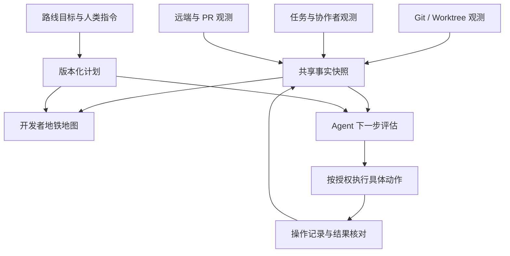

# DevMap：地铁拓扑与自动 Git 的统一产品方案

日期：2026-09-05

状态：用户已确认方向并授权阶段 1–2；实现范围与验证见 [开发记录](../plans/2026-09-05-devmap-unified-progress.md)。

核对基线：`fef7a78196e9af2cae721e3ed9edfac4a373a819`。

## 1. 唯一主线

**让开发者一眼看清：谁在什么工作区，从哪里分出，代码走到哪里，还差什么，准备交付到哪里；让 Agent 读取同一组事实，按已有授权推进 Git 工作。**

地图是主界面，自动 Git 是执行层，二者共用事实、路线身份和执行结果。地铁比喻帮助读图，不改变 Git 的真实关系。判断一次修改有没有价值，只看它是否让上述问题更容易回答，或者让 Agent 的下一步更可靠。

首版以一个本地仓库、多 Worktree、多任务为范围。跨仓库交付、跨机器调度、完整需求知识图谱和自动清理不进入本轮主线。

## 2. 收敛历史方向

这不是用户逻辑自相矛盾，而是产品范围逐步演进，设计与实现没有始终同步收口。

| 历史方向或实现 | 本方案的处理 |
| --- | --- |
| 早期需求、决策、证据的力导向知识图谱 | 保留现有证据能力；不作为默认地图形态，不扩大首屏信息量 |
| Git 地铁拓扑、真实历史优先 | 继续作为地图基础；已有采集与布局不推倒重写 |
| 地图核心不执行 Git | 保持读取与执行隔离；新增独立执行层，地图观察结果，不让渲染器发 Git 命令 |
| 虚线曾同时表示关联和未来 | 收口为仅表示明确计划；关联使用细灰连接线，未知使用文字和边界标记 |
| 一度要求地图展开全部乘客 | 首屏保留人数和状态；名单在检查面板，不再改变轨道几何 |
| 目录名作为站台主标题 | 改成真实分支/Detached HEAD 身份优先，目录辅助识别 |
| 先决定全部边界、再允许工作 | 改为少量不变准则与常见流程；无法确认的情况返回未知或待核对 |

本文获确认后，作为这一轮产品范围和语义的入口，覆盖旧文档中与之冲突的规定。旧文档保留历史，不逐篇重写。优先级：最新明确用户要求 → 本方案 → 相容的旧设计。技术执行计划见同日 `devmap-unified-roadmap`。

## 3. 当前成果与实际缺口

| 能力 | 基线中实际情况 | 本轮取舍 |
| --- | --- | --- |
| Git 提交与父子关系、引用、Worktree 采集 | 已有 | 复用 |
| 轨道布局、窄栏/宽图、缩放和选择 | 已有 | 只修语义与必要的阅读问题 |
| 任务关联、观测完整性、Subagent 明细 | 已有 | 保留独立的观测状态，精简首屏文案 |
| 实际分支与目录身份 | 数据已有，展示易混淆 | 优先修复 |
| 真正的创建与换乘历史 | 未持续可靠记录 | 从接入后记录；不补造旧历史 |
| 路线目标和阶段 | `route_plan.rs` 已有版本化元数据 | 扩展，不另造一套路由库 |
| Agent 数据视图 | 已有，明确 `authorization_verified=false` | 补下一步评估与原因 |
| 自动 worktree / commit / push / PR / 串行合并 | 未见完整执行层，`src/workflow.rs` 尚不存在 | 分期新增，不宣称已经自动化 |

`RoutePlan.start_commit` 是创建路线计划时取得的提交。既不能把它标成 Worktree 的真实创建点，也不能把共同祖先标成真实创建点。

现在够用的部分：真实 DAG、独立检查面板、稳定几何、任务数量与未知状态的基本规则。问题集中在身份标识、历史与当前的层次，以及流程缺少真实执行证据。

## 4. 固定名词与图形语义

| 对象 | 定义 | 图中表达 |
| --- | --- | --- |
| Commit / 站点 | 已存在的代码快照 | 圆形节点，详情显示 SHA；父子关系决定顺序 |
| 实际历史 | Git 的真实提交父子关系 | 有颜色的实线轨道；颜色只帮助辨认，不证明永久分支归属 |
| Branch / 分支引用 | 指向提交的可移动名字 | 标签挂在它实际指向的提交上；`main` 标签必须在 main tip |
| Worktree / 站台 | 包含 HEAD、索引和工作目录的实际工作区 | 附着在 HEAD 站点旁的短标签与细灰关联线，不生成额外提交 |
| Passenger / 乘客 | 项目下存在且未归档的任务 | 人形图标与人数；运行中/空闲/完成和是否存在分别记录 |
| Subagent / 协作者 | 有明确父任务关联的执行者 | 父任务下的小型协作图标与明细；不凭名字猜关联，不重复计数 |
| Route / 开发路线 | 有稳定 ID、目标和交付目的地的工作单元 | 关联工作区、分支、任务；这些对象改变不强制更换路线 ID |
| 创建/换乘事件 | 被实际观察或执行器确认的创建、迁移事实 | 起点标记和来源；创建后尚无新提交时不画虚构的实线分支 |
| 未来交付计划 | 明确记录、尚未发生的目标 | 虚线通往独立的“计划交付到…”区域，不接成已发生的 merge |
| 未提交修改 | 工作目录与索引中的变化 | 站台旁“未提交 N 文件”，不作为新 Commit |
| PR / 检查 / 队列 | 外部或执行器提供的流程证据 | 紧凑状态标签，详情展开，不增加伪 Git 节点 |

同一 Commit 只画一个站点；同一 HEAD 上可以有多个站台。分支没有 Worktree 时仍可查询。Detached HEAD 明确标注短 SHA，不用目录名冒充分支。共享工作区中的多个任务不自动变成多条代码路线。

“当前”必须拆开：**本任务工作区**、**选中的工作区**、**某分支最新提交**。宿主任务登记目录与 Agent 实际执行目录不同的时候，显示两者及关联来源；执行器必须显式指定工作区，不能借用查看器焦点。

## 5. 地图应该怎样读

### 默认开发视图

使用同一张拓扑，聚焦本任务工作区及关联路线。首屏突出：真实分支名、HEAD、乘客数、未提交状态和交付目标。选择某条路线后，能沿轨道定位其已知起点；超出视口时提供定位入口，不把视口外误标成未知。

站台建议文本结构（示意，不代表当前真实数据）：

```text
codex/search                       ← 真实分支名
本任务工作区 · search-worktree     ← 目录与上下文
[人] 2 个任务 · 未提交 3 文件
计划交付到 main · 尚未创建 PR
```

信息不足时用“已观察到 2 个任务，名单不完整”，不用 `2 observed · unknown`。没有可靠完整名单时用“任务数量未确认”，不显示确定的“无人”。有已知乘客可显示已知数量，并说明下限。

保留有未提交修改、未交付提交、有效路线或已知乘客的工作区。对于仅能确定 HEAD 已包含、工作区干净的旧站台，降低视觉权重；只有任务名单也可靠完整且无人、没有开放路线和其他未解决风险时，才可默认收进“保留工作区 N”。这只是视图折叠，不删除工作区，不宣称可以安全清理。未知与风险工作区始终有可发现入口。

### 全图视图

同一模型展开全部已加载分支与工作区，允许折叠普通中间提交段，但必须标明数量，并保留所有分叉、合流、引用、HEAD、记录起点与边界。折叠只是视图变换，不能把连接换成虚构历史。

“全图”明确表示已加载范围；数据有上限或浅克隆时显示边界。不把全部历史压成不可读小点。不为全图再造一套状态判断。普通历史折叠不是第一阶段的必需项：现有滚动足够时保留现状。

### 时间、起点与合入

- 窄栏从上到下，宽图从左到右，均表示父提交到后代；跨平行分支的相对位置不承诺全局时间先后。
- 图例使用“较早历史 → 后续提交（按父子关系）”；详情展示时间，不用空间距离代表耗时。
- 记录的创建点、计划建立点、当前共同祖先是三个字段；没有创建记录就直接说明。
- 合并提交用真实双亲轨道表示。快进只展示引用推进和“已包含”，不补画 merge 节点。
- squash/cherry-pick 有独立可靠证据时显示交付关系；不把它们画成不存在的父子边。
- 目标包含旧 HEAD，不等于当前未提交修改或之后新提交已经交付。

### 交互和布局约束

保持既有地铁配色、节点与独立检查面板。轨道不随乘客展开移动。刷新保持选择和视角；有事实变化才更新相关标签。主线交叉处必须能区分连接与跨越。窄栏优先检查 390、516px，宽图检查 1280px；保留 200% 文字缩放和键盘导航。无需再次制作装饰性视觉稿才开始修复语义。

## 6. 一份数据，两个使用者



UI 坐标和折叠状态不是事实。Agent 返回结构化字段，不靠读截图或解析标签作决定。共享快照保持相同实体 ID 和 revision；Git、任务、远端、PR 各自有观测时间、来源和完整性，不能用 Git 刷新时间替代全部数据的新鲜度。

在现有模型上增加或明确这些信息：

- `origin`：种类为 recorded_creation / plan_start / common_ancestor / unknown，附 OID、来源和事件时间；各种证据可并存，不用单值互相覆盖。
- `route_id` 稳定；`bindings` 保存 worktree/ref/task 的观察和迁移事件；现有绑定字段兼容读取。
- `delivery_target`：目标仓库、完整 ref、已解析 OID；发车时记录基准 OID，交付前重新读取目标，不能永远沿用发车时的旧值。
- `workspace_state`、`publication`、`integration`、`checks`、`passengers` 分维度存在，避免一个“完成”掩盖其他未完事项。
- `next_actions`：动作类型、对象、理由、前置条件、缺失条件；readiness、执行授权和能力可用性分开返回。
- `operation`：唯一 request ID、输入摘要、预期前状态、尝试记录、后状态和证据；超时可能是结果未知，不直接标失败并重做。

迁移使用明确 schema 版本并保留旧读取兼容；旧记录没有的字段返回未知。事件存储复用现有 journal 与安全路径处理，不为此引入图数据库或常驻调度服务。

## 7. Agent 自动 Git：何时做什么

Agent 按任务语义提出“开始开发”“里程碑完成”“准备评审”等事件，确定性规则核对事实与授权。闲置时间、聊天结束和 diff 大小本身不证明完成。

| 动作 | 触发时机 | 执行前必须满足 | 地图上的结果 |
| --- | --- | --- | --- |
| 创建/复用 Worktree | 独立开发任务即将第一次写代码 | 明确起点、路线与目标；没有适合复用的隔离工作区，或确需隔离并行写入；目标目录无冲突 | 被核对的创建事件、起始 OID、任务与站台关联 |
| Commit | 一项可描述的变更达到项目约定的提交点 | 明确文件/变更归属；暂存内容与清单一致；适用检查完成；HEAD、索引和选定内容未变 | 新的真实站点；仍独立显示未提交剩余项 |
| Push | 本地提交需要备份、交接或送审 | 已有该远端/分支的推送授权；核对远端身份和 ref；提交范围明确；普通推送可完成 | “已发布到…”及实际远端 OID；未知远端状态不标已发布 |
| 创建 Draft PR | 已有可评审切片，需要提前协作 | 分支已发布、目标已知、范围清晰；已授权创建 PR；检查现有同源同目标 PR | 真实 PR 编号、Draft 状态 |
| 创建/更新正式 PR | 路线交付条件满足，准备交付评审 | 分支已发布；检查证据匹配提交；标题、说明、目标准确；满足仓库评审约定 | 已观察的 PR 与检查状态；PR 存在不等于合入 |
| 串行合入目标 | PR 达到交付条件并且具有合并授权 | 同目标队列轮到该项；源/目标未偏离已验证版本；要求的检查与评审有效 | 实际合入证据或具体阻塞原因 |

默认建议：独立写任务优先复用其专用 Worktree；新聊天、只读调查、共享只读 Subagent 不各自创建 Worktree。独立写入的 Subagent 才需要独立路线/工作区，或者明确的协同写入安排。

Commit 默认是语义里程碑，不按每个回复自动提交。中途恢复点优先记录工作状态；只有项目明确允许 checkpoint commit 时才创建并标明未完成。受控自动 commit 不使用全目录盲目暂存；混有未知修改或同文件归属重叠时返回待核对。

自动 PR 默认在准备交付时创建正式 PR；提前 Draft 作为项目选择，不强迫每个空分支立即开 PR。同一来源分支与目标已有开放 PR 时更新它；重复请求不得重复开 PR。

“授权后自动”意味着在持续有效的范围内继续，不每一步重复向人确认。允许的动作、仓库、分支范围和截止条件由宿主确认的人类授权提供；Agent 填写的 `authorization_source` 字符串不是授权凭据。没有执行能力或授权时，评估器仍可给出建议及原因。

## 8. 多 Agent、人工操作与恢复：只保留必要准则

1. **真实状态优先。** 人工 commit、cherry-pick、回退、重命名与换工作区之后重新读取事实；不能为了旧路线自动补回被撤回的代码。
2. **人类身份不能猜。** 无来源的历史改写显示“检测到外部变更”；明确的人类新指令才覆盖旧意图。普通 revert 也是提交，不天然是错误。
3. **只影响相关自动动作。** 若变化使旧检查或交付前提失效，相关动作进入待核对；地图仍显示真实数据。警报说明源/目标差异和证据，不能笼统判“不合理”。
4. **锁覆盖实际共享资源。** 本地 Git 写入用仓库协调锁保护 refs/worktree 管理，并以工作区写锁保护 HEAD/索引；合入用目标 ref 队列锁串行化。固定获取顺序，避免死锁。开发与等待检查期间不长期占目标锁。
5. **锁不是防人操作的结界。** 外部 Git 不遵守 DevMap 的应用锁，所以写入前后还要核对 HEAD、索引、工作内容和远端状态；不承诺与任意外部写入完全隔离。
6. **同一目标逐个进入。** 在同一授权范围内默认按就绪进入队列的顺序；人类可调整。阻塞项保留原因，其他独立就绪项可继续；有显式依赖的路线不能越过依赖。目标推进后重验后续候选，不能沿用旧目标上的合并检查。
7. **所有实际成功都可核对。** 中断恢复先核对是否已经创建 Worktree、产生 Commit、完成 Push 或创建 PR；结果未知先查询，不盲目重复写。失败不自动 reset、stash、force push、rebase 或删除用户资源。

本地锁只协调当前机器上的执行器。远端并发最终由 Git/托管平台的引用更新及合并条件核对；无法保证远端条件时不开放自动合并。跨机器全局队列不在此版承诺内。

任务全部归档/删除只说明没有已知乘客。若完整新鲜观测确认无人且存在未提交/未交付工作，提示需要接手；干净且已经交付则只是保留站台。观测不完整不能判无人。无论哪一种都不自动清理。

## 9. Skill / MCP 表面

保持一个 DevMap 主 Skill。先保留现有地图三个入口：`devmap_open_map`、`devmap_read_map`、`devmap_set_route_plan`。不为创建、提交、推送、PR 各加一个 Skill。

执行层交付时建议增加两个入口：

- `devmap_evaluate_workflow`：不修改源 Git；接收明确 route/worktree 与语义事件，返回具体动作提案、证据、缺项和授权状态。
- `devmap_execute_operation`：执行一个已评估的、强类型的 Git 操作。要求 proposal/request ID、预期版本与有效授权；限定枚举，不接受任意 shell 命令。执行前重新核对，不把旧提案当永久许可。

这使核心工作流为 1 个 Skill、5 个目标导向 tools。现有 requirement/decision/evidence 采集工具和兼容别名另计，不能宣传整个服务器总共只有 5 个。未交付执行层之前，不暴露会误导模型的可写能力。

## 10. 顺序与完成标准

顺序固定：**语义统一 → 地图可读 → Agent 可判下一步 → 本地写入闭环 → Push/PR → 串行交付**。阶段可以独立验收，地图不必等完整执行器才可用。

地图验收用一个固定场景：main 上两条并行路线，一条从 feature 再分出；一个共享 HEAD 的双 Worktree；一个旧但干净且已包含的 Worktree；一个有未提交工作的无人工作区；一个名单未知工作区。再用实际仓库复核 `devmap-main` 目录不再被误读为 main。

让未参与实现的人看默认图与全图，在 10 秒内尝试回答：

1. main 最新提交在哪里？本任务工作区在哪里？
2. 哪条工作线从哪个站分出，起点是记录还是推断？
3. 哪些工作区有乘客，哪些只是未知？
4. 哪些还有未提交、未发布、未交付的工作？
5. 选中路线最终去哪，当前缺哪一步？

10 秒是可用性目标，不由字符串测试冒充通过。人工试读没通过，就围绕答错原因调整；通过之后停止无收益的美化。

自动化验收必须在临时仓库和受控远端完成完整事实核对：新路线→隔离写入→准确 commit→push→同一 PR→符合条件才合入。并发、人工改动、旧检查、中断重试不能产生重复提交/PR或覆盖他人修改。地图与 Agent 对同一快照的状态必须一致。

发布验收分开记录：源码测试通过、预览验证通过、main 已合并、插件实际版本已更新。一次临时截图不能证明本地插件已更新。

本轮不做：新的配色竞赛、更多装饰性地铁图标、强制全历史一屏塞满、自动清理工作区、从历史猜创建人与创建点、把全部 Git 边界编码为庞大状态机、给每个动作拆 Skill、用新增功能掩盖身份和来源错误。
