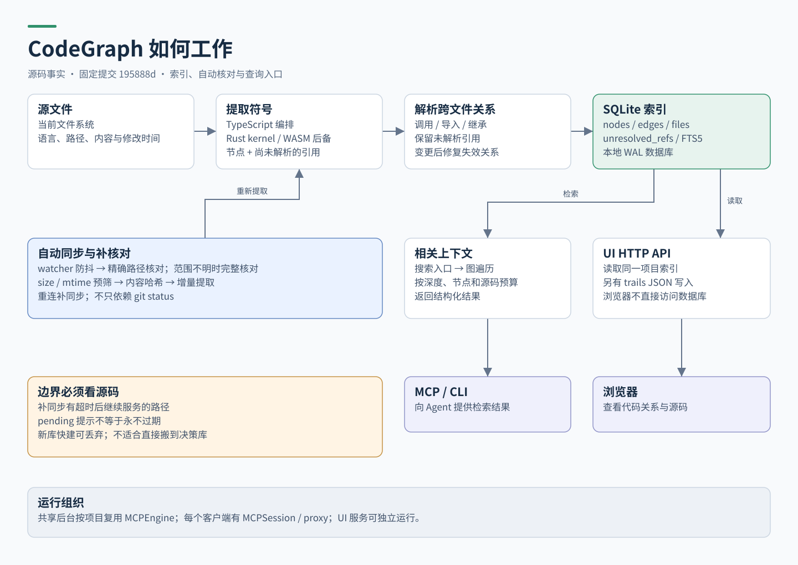

# CodeGraph：实现方式与运行逻辑

## 1. 研究结论

CodeGraph 将代码理解中反复进行的结构查找预先做成索引：扫描源文件，提取符号和引用，解析跨文件关系，存入 SQLite，再用搜索和图遍历组织回答。AI 不必每次从零寻找所有调用关系。

它提供了一个可参考的工程模式：**领域核心 + 本地数据库 + 自动同步 + 多种查询入口**。但其解析器、后台管理和查询优化并不简单；可用性来自封装和自动化，不能把“一个 .db”理解为整个产品只有一个文件或一种进程。

研究方式：静态读取固定提交的源码，检查调用关系和关键分支。未执行安装器、未建立真实代码索引、未复现基准测试。以下“已实现”表示源码存在对应路径，不表示本机端到端验证通过。

## 2. 用户入口与内部职责

| 入口 | 用户得到什么 | 内部职责与边界 |
|---|---|---|
| 安装 CLI | 可调用 codegraph | 发布包管理运行时和平台构件；安装 CLI 不等于完成宿主接入 |
| codegraph install | 配置所用 Agent | installer 按目标宿主修改其接入配置；不是建索引 |
| codegraph init | 初始化当前项目并建图 | 解析项目根，创建本地存储，扫描、提取、解析并落库 |
| codegraph serve --mcp | Agent 查询能力 | MCP 启动路径决定直接服务或通过代理连接共享后台 |
| codegraph ui | 浏览代码图 | 本地 HTTP 服务读取相同索引，提供浏览器资源与 API |
| codegraph status / sync | 状态诊断或显式刷新 | 日常可自动同步；诊断、离线脚本和受限环境仍需显式入口 |

来源：[CLI](https://github.com/colbymchenry/codegraph/blob/195888d71f3ad053bfa725f24b3d3e9353c50e09/src/bin/codegraph.ts)、[MCP 入口](https://github.com/colbymchenry/codegraph/blob/195888d71f3ad053bfa725f24b3d3e9353c50e09/src/mcp/index.ts)、[UI 服务](https://github.com/colbymchenry/codegraph/blob/195888d71f3ad053bfa725f24b3d3e9353c50e09/src/ui-server/index.ts)。

## 3. 首次建图：先提取，再解析关系

CodeGraph 类负责装配数据库、提取器、引用解析器、图查询与上下文构建器。`indexAll()` 使用进程内互斥和文件锁防止重叠建库，随后运行以下阶段：

1. 建立索引中状态，枚举需要处理的文件。
2. 根据语言提取函数、类等节点，以及尚未解析的引用。
3. 将节点、文件元数据和待解析引用写入数据库。大批量装载阶段可以暂缓二级索引与全文索引维护，之后统一重建。
4. 在已有文件信息后重新初始化框架解析器，补充框架相关关系。
5. 解析跨文件引用，生成调用、导入、继承等边，并执行后续维护。

这里的重要顺序是：先有符号集合，才能可靠地寻找引用目标。关系无法解析时保留待处理记录，而不是强行生成一条确定的边。

原生 Rust kernel 通过 Node addon 加载；加载失败、ABI 不匹配等路径返回不可用，再走 WASM 提取管线。因此它是 TypeScript 编排与原生加速结合的实现，并非一个纯 Rust 应用。SQLite 适配器使用 Node 内置 `node:sqlite`；源码注释要求从源码运行时 Node >= 22.5，而 package.json 的 engines 范围更宽。实际源码运行要求需要验证，不能只看包字段。

来源：[核心编排](https://github.com/colbymchenry/codegraph/blob/195888d71f3ad053bfa725f24b3d3e9353c50e09/src/index.ts)、[kernel loader](https://github.com/colbymchenry/codegraph/blob/195888d71f3ad053bfa725f24b3d3e9353c50e09/src/extraction/kernel/loader.ts)、[SQLite adapter](https://github.com/colbymchenry/codegraph/blob/195888d71f3ad053bfa725f24b3d3e9353c50e09/src/db/sqlite-adapter.ts)、[package.json](https://github.com/colbymchenry/codegraph/blob/195888d71f3ad053bfa725f24b3d3e9353c50e09/package.json)。

## 4. 数据库：关系表就能表达图

核心数据包括：`nodes` 保存符号和源位置；`edges` 保存 source、target、kind 与 provenance；`files` 保存哈希、修改与索引时间；`unresolved_refs` 保存待解析或失败引用；`nodes_fts` 提供 FTS5 搜索；另外有 schema version 和项目元数据。

这些表将图表示为“实体 + 关系”，不依赖独立图数据库服务。复杂信息可局部存为 JSON 字段，而身份、关系、时间和查询索引仍使用明确的列。

`DatabaseConnection` 集中配置外键、WAL、busy timeout、缓存和 WAL 维护。SQLite 不会消除进程协调：源码另有 writer.pid、daemon.pid、socket / Windows named pipe，以及建库锁。

也并非所有持久信息都在数据库：UI 的命名 trails 会写入 `.codegraph/ui/trails/` 下的 JSON。不要将 README 的“SQLite database only”扩展解释为所有功能都无其他状态文件。

来源：[schema](https://github.com/colbymchenry/codegraph/blob/195888d71f3ad053bfa725f24b3d3e9353c50e09/src/db/schema.sql)、[连接管理](https://github.com/colbymchenry/codegraph/blob/195888d71f3ad053bfa725f24b3d3e9353c50e09/src/db/index.ts)、[运行路径](https://github.com/colbymchenry/codegraph/blob/195888d71f3ad053bfa725f24b3d3e9353c50e09/src/mcp/daemon-paths.ts)、[UI 服务](https://github.com/colbymchenry/codegraph/blob/195888d71f3ad053bfa725f24b3d3e9353c50e09/src/ui-server/index.ts)。

## 5. 自动同步：变更提示 + 核对 + 修复受影响关系

文件 watcher 记录 pending 集合，并通过防抖合并编辑事件。已知准确文件集合时，只核对这些路径；事件溢出、目录变化等不能确定范围时，退回完整扫描核对。

核对依据是文件系统与索引状态的差异：先用 size、mtime 过滤，再用内容哈希确认。不能只依赖 `git status`，因为 pull、checkout 后工作区即使干净，内容也可能已改变。`ExtractionOrchestrator.sync()` 明确实现了这个区别。

增量提取后不仅更新被编辑文件，也可能重新打开其他文件中已经失效的解析关系。例如 A 删除一个定义，B 没有修改，但 B 指向 A 的关系必须重新检查。正确的增量结果应收敛到完整重建结果。

启动/重连还会进行 catch-up，弥补后台停机期间的变化。MCP 工具对涉及 pending 文件的结果增加过期提示。但 `awaitCatchUpGate()` 有超时分支，超时会记录日志后继续服务；异常核对也可能退回尽力返回。因此“永不过期”不能作为从源码得出的保证。

来源：[watcher](https://github.com/colbymchenry/codegraph/blob/195888d71f3ad053bfa725f24b3d3e9353c50e09/src/sync/watcher.ts)、[文件核对](https://github.com/colbymchenry/codegraph/blob/195888d71f3ad053bfa725f24b3d3e9353c50e09/src/extraction/index.ts)、[增量关系修复](https://github.com/colbymchenry/codegraph/blob/195888d71f3ad053bfa725f24b3d3e9353c50e09/src/index.ts)、[过期提示与 catch-up gate](https://github.com/colbymchenry/codegraph/blob/195888d71f3ad053bfa725f24b3d3e9353c50e09/src/mcp/tools.ts)。

## 6. 查询：搜索入口，再沿关系扩展

`ContextBuilder.buildContext()` 先调用相关上下文查找，结合搜索候选和有界图遍历，提取入口、相关文件及可选源码片段，最后输出结构化对象、Markdown 或 JSON。节点数、深度、片段数量与大小都有预算参数。

对 DevMap 的启示是：先回答“当前任务在哪里、目标是什么、有什么阻塞”，再按请求展开历史。不要每次 MCP 调用都发送整张图。CodeGraph 的少调用优势也不能直接推导为更小的常驻上下文；其 README 自己区分了累计 token 使用量与长会话残留上下文。本文不采用其性能宣传作为 DevMap 指标。

来源：[ContextBuilder](https://github.com/colbymchenry/codegraph/blob/195888d71f3ad053bfa725f24b3d3e9353c50e09/src/context/index.ts)、[图遍历](https://github.com/colbymchenry/codegraph/blob/195888d71f3ad053bfa725f24b3d3e9353c50e09/src/graph/traversal.ts)、[README](https://github.com/colbymchenry/codegraph/blob/195888d71f3ad053bfa725f24b3d3e9353c50e09/README.md)。

## 7. 多 Agent：共享重资源，隔离会话

共享后台模式按项目根复用一个 MCPEngine，避免每个 Agent 重复启动 watcher 和解析引擎。每个连接拥有自己的 MCPSession，宿主通过轻量 proxy 接入。最后一个客户端断开后，后台默认等待 300 秒再退出，减少连续会话反复冷启动。

这不是严格的“一个 OS 进程”：代理、查询 worker 和 UI 服务仍可能独立存在。应该借鉴“同一份重资源和写入所有权”，不应承诺所有入口只有一个进程。

worktree 检查通过当前 Git 工作根和索引根识别串用，并比较 git common dir 排除无关仓库。发现同仓库不同工作树时提示建立当前工作树索引。CodeGraph 以工作树代码索引为边界；DevMap 要展示整个仓库的 worktree，不能直接复制它的数据库划分规则。

来源：[daemon](https://github.com/colbymchenry/codegraph/blob/195888d71f3ad053bfa725f24b3d3e9353c50e09/src/mcp/daemon.ts)、[engine](https://github.com/colbymchenry/codegraph/blob/195888d71f3ad053bfa725f24b3d3e9353c50e09/src/mcp/engine.ts)、[writer lock](https://github.com/colbymchenry/codegraph/blob/195888d71f3ad053bfa725f24b3d3e9353c50e09/src/mcp/writer-lock.ts)、[worktree](https://github.com/colbymchenry/codegraph/blob/195888d71f3ad053bfa725f24b3d3e9353c50e09/src/sync/worktree.ts)。

## 8. 学什么，不照搬什么

| 采用的思路 | 不直接照搬的内容 | 原因 |
|---|---|---|
| SQLite + 明确的领域表 | AST、跨语言调用解析、全文检索全套引擎 | DevMap 目前解决任务/Git 关系，而非代码语义索引 |
| 共享核心与按需启动 | 全部 worker pool、WAL 批量优化 | 先测实际瓶颈，避免复制别人的规模成本 |
| 哈希核对与显式 freshness | “watcher 一直工作，所以永远最新” | watcher 会漏事件，宿主会断开，Git 状态会并发变化 |
| 同一数据服务多个入口 | UI 与 MCP 必须同一个进程 | 共用查询语义比物理进程数量更关键 |
| 可重建索引的恢复方式 | 首次建库 synchronous=OFF | DevMap 数据库内有人类决策，不能全库视为可丢弃 |
| 简洁接入流程 | 直接改成 TypeScript / Node 技术栈 | 现有 Rust 领域逻辑和发布入口可继续使用 |

CodeGraph 的新库快建会临时使用 MEMORY journal 和 synchronous=OFF；正常配置是 WAL / NORMAL。这适用于其明确可重建阶段，不能复制到 DevMap 的持久决策库。[核心编排](https://github.com/colbymchenry/codegraph/blob/195888d71f3ad053bfa725f24b3d3e9353c50e09/src/index.ts)

另一个产品表述边界：本地索引不等于程序完全无网络。固定版本有匿名遥测和更新检查路径；文档说明了关闭方式。因此 DevMap 的“本地”承诺应具体描述数据流，不能照抄绝对表述。[遥测说明](https://github.com/colbymchenry/codegraph/blob/195888d71f3ad053bfa725f24b3d3e9353c50e09/TELEMETRY.md)

## 9. 源码复核入口

固定提交：`195888d71f3ad053bfa725f24b3d3e9353c50e09`。推荐按此顺序读：

1. src/bin/codegraph.ts → src/index.ts：入口和核心编排。
2. src/db/schema.sql → sqlite-adapter.ts → index.ts：数据结构和连接策略。
3. src/extraction/index.ts → src/resolution/：提取、核对和引用解析。
4. src/sync/watcher.ts → src/mcp/tools.ts：pending、补同步和查询边界。
5. src/context/index.ts → src/graph/traversal.ts：有界检索。
6. src/mcp/index.ts → daemon.ts → engine.ts → session.ts：多客户端生命周期。
7. src/sync/worktree.ts → src/ui-server/index.ts：身份边界和人类入口。

后续若要采用它的具体优化，先在公开小仓库上复现初建、增量更新、后台中断、双客户端和 worktree 错配，再决定。这个验证不是当前文档中已完成的工作。
