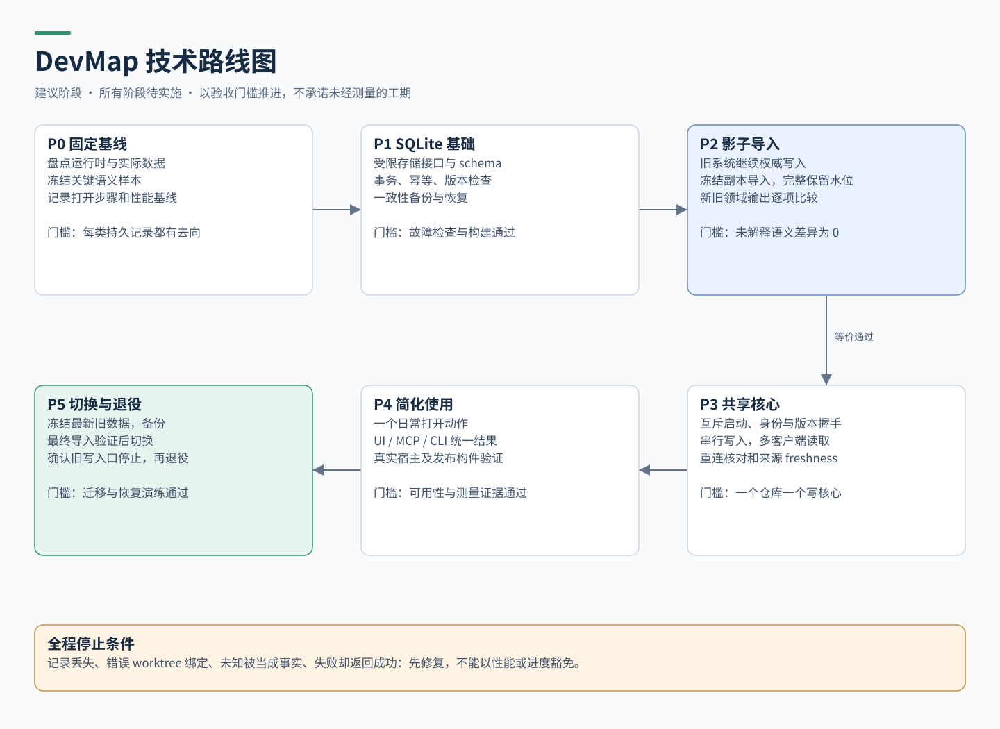
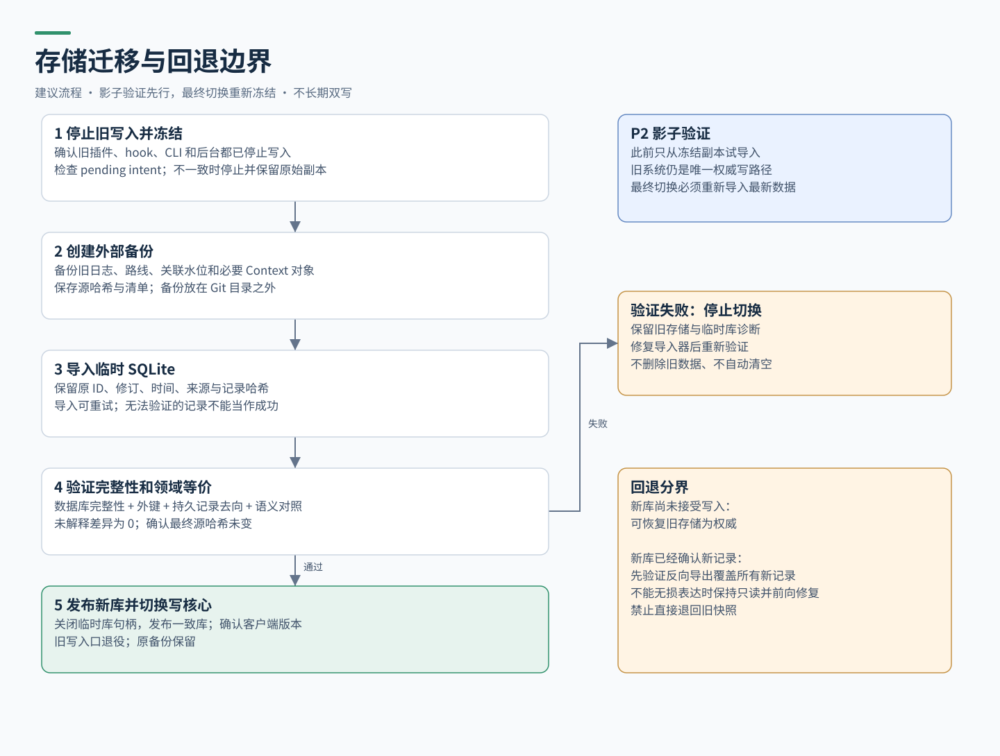

# DevMap 简化技术路线图

本路线图按依赖和验收门槛排序，不给未经测量的日历承诺。所有阶段当前都属于待实施；本次已完成的是设计研究和产物整理。

## 1. 总顺序

P0 基线冻结 → P1 SQLite 存储基础 → P2 影子导入与语义对照 → P3 共享核心 → P4 简化入口与真实宿主验证 → P5 切换及退役旧写路径。

不能跳过 P2 直接切换；不能只凭数据库单元测试通过就宣布多 Agent 或跨平台可用。性能优化服从语义一致性和数据保留。

## 2. P0：确认真实基线与存储契约

**目的：** 确认接下来迁移的是实际使用的数据，而不是只对老设计分支改造。

- 核对选定开发分支、源提交、已安装插件版本、运行进程版本和数据目录，记录差异。
- 盘点 route-plans、会话 journal、presence、任务关联、水位和 Context 对象；列出生产者、消费者、保留性质与恢复方式。
- 记录现有语义样本：空仓库、多 worktree、任务关联变更、部分任务列表、租约过期、路线修订、撤回、cherry-pick/squash 关系与未知状态。
- 记录打开步骤、冷启动时间、热查询延迟、刷新延迟、RSS、后台数量、每次刷新 Git 命令数和状态文件数。

**交付物：** 固定基线清单、存储清单、语义样本、性能基准输入和测试方法。

**通过条件：** 每类持久数据都有迁移或明确 legacy-only 方案；每条关键语义都有可重复检查的样本。

**停止条件：** 数据来源/运行时不明、旧文件存在未解决写入意图或损坏。先诊断，不自行猜测导入或清空。

## 3. P1：引入 SQLite 存储基础

**依赖：** P0 契约通过。

- 新增受限 RepositoryStore；以独立测试库验证 schema、唯一键、外键、事务和版本检查。
- 优先验证 events、route_revisions、task binding 与 watermark 的事务组合，再验证可重建投影。
- 保留 request_id、expected_revision、start_commit、来源与捕获等级；绑定 worktree incarnation。
- 确定 Rust SQLite binding 与 bundled 构建；在发布目标 OS/架构上验证构件可执行。
- 实现一致性备份、恢复、版本拒绝和诊断，尚不接管旧数据。

**交付物：** 可测试的存储实现、migration v1、恢复工具、构建证据。

**通过条件：** 重复事件、冲突版本、多写竞争、提交边界进程终止、磁盘/写失败注入均有确定结果；已确认记录与相应水位不分离。

**停止条件：** 返回成功后重启记录缺失、重复记录被计为新事件、写失败被当作成功，或任何声明支持的平台不能构建/启动。

## 4. P2：影子导入与旧新语义对照

**依赖：** P1 存储和恢复通过；旧系统仍为权威写路径。

- 从一致的冻结副本导入临时 SQLite；真实旧目录保持原样。
- 导入器先验证旧格式，再记录源文件哈希、记录身份、旧提交/版本和接受/拒绝原因。
- route revision、事件、任务关联及独立 watermark 都要导入；不能只重放变化事件而丢掉“状态未变但观察时间更新”的水位。
- 对同一冻结输入、同一租约计算时间，比较旧 reducer 与新 query 输出，规范化无语义差异的排序/时间字段。
- 影子库保持一次性验证副本，不能继续作为活跃数据副本；最终切换时重新冻结最新旧数据并重新导入。

**交付物：** dry-run 报告、来源到新记录的映射、逐项差异报告、恢复演练记录。

**通过条件：** 所有纳入迁移的持久记录均有去向；未解释的语义差异为 0；重复导入无重复结果；旧系统继续正常工作。

**停止条件：** 丢失原记录、错误扩大数据可信度、路线起点变化、partial 列表删任务、旧数据格式无法验证。

## 5. P3：统一共享核心与观察

**依赖：** P2 等价通过。

- 将应用服务用于 direct 与 shared 两种运行模式，领域规则保持同一实现。
- 加入按仓库发现、互斥启动、身份/版本握手、本地 IPC、写队列、只读查询和空闲退出。
- 整合 Git 刷新与宿主观察，加入重连补核对、快照 generation、来源 freshness 和 capture gap。
- watcher 仅为刷新信号；覆盖 refs、worktree 增删、后台离线期间 Git 操作的核对路径。
- 在隔离环境测试四个并发客户端，确认一个仓库只有一个写核心；客户端会话状态独立。

**交付物：** 共享运行时、生命周期诊断、并发/恢复检查报告。

**通过条件：** 并发启动不产生双写核心；关闭一个客户端不影响其他客户端；后台被终止后可重连且不重复接受命令；迟到观察不会覆盖新水位。

**停止条件：** PID 误认导致结束其他进程、跨仓库串用、无限锁等待、多个 watcher 反复扫描，或未提交就返回成功。

## 6. P4：简化入口与真实使用验证

**依赖：** P3 并发与恢复通过。

- 复用现有分发入口；日常“打开地图”自动解析仓库、初始化本地库并启动服务。全局宿主接入仍只配置一次。
- 保持已有 MCP 工具兼容；UI/MCP/CLI 返回相同 query envelope，详情按需展开。
- 从干净工作区演练安装/接入 → 打开 → 看到任务 → 刷新 → 关闭/重开；不要求用户手工创建 Context Repository。
- 先验证用户真实使用的宿主，再按宣称支持列表逐一扩展。实际覆盖能力写入 capability 状态，不用模拟 fixture 冒充宿主 E2E。
- 执行下方性能和可用性检查；记录基线和新版本，不引用 CodeGraph 的宣传数字。

**交付物：** 安装与使用说明、端到端录屏/截图或日志、兼容与性能报告。

**通过条件：** 已接入用户从目标 worktree 用一个日常打开动作看到地图；无需管理数据文件；同输入 UI 与 MCP 状态一致；全部性能门槛有测量证据或明确未达标记录。

**停止条件：** 默认流程增加手动初始化/启动步骤、任务绑定错位、数据过期但显示最新，或发布构件只在开发机可用。

## 7. P5：受控切换与旧写路径退役

**依赖：** P4 真实使用通过，恢复演练再次通过。

1. 进入维护状态，停止并确认所有旧写进程，包括旧插件和 hook；冻结源数据，生成 Git 管理目录外的备份与哈希。
2. 检查没有悬挂的旧写入意图；导入新临时库，记录导入清单，校验 integrity、外键和语义摘要。
3. 关闭新库连接并形成一致检查点，在无使用中的句柄时发布 devmap.db；只在验证通过后切换后端选择。
4. 启动新写核心，确认所有客户端使用兼容版本。旧日志冻结，只保留兼容读取和导出，不能继续双写。
5. 通过一个明确记录起止版本的试用周期后，才删除仓库代码中的旧写路径。原备份与 legacy-only 对象不随代码清理自动删除。

**回退规则必须分界：** 新库尚未接收新写入时，可停止新核心并重新启用冻结旧存储。新库已经确认新记录后，禁止直接回到旧快照；必须用 P2/P5 验证过的反向导出覆盖所有新记录与水位。若反向格式不能表达全部新信息，进入只读维护并前向修复，保留新库，不承诺无损降级。

**交付物：** 最终迁移报告、激活记录、备份验证、切换后诊断、旧写代码退役清单。

**通过条件：** 已验证所有旧写入口停用、每个持久记录有溯源、新版本连续试用通过，且没有来源/语义提升错误。

**停止条件：** 不能冻结旧写入、最终源哈希变化、反向导出丢字段、启动遇到未知 schema、损坏被自动删库“修复”。

## 8. 验收矩阵

| 场景 | 必须观察到的结果 | 阶段 |
|---|---|---|
| 同 request_id 提交两次 | 一个结果、一个版本；不同内容报冲突 | P1 |
| 两客户端同时更新路线 | expected_revision 只允许一个成功，另一个明确冲突 | P1/P3 |
| 提交前、提交后响应前分别终止 | 前者没有成功承诺；后者重试找到原结果 | P1/P3 |
| 导入中断及再次导入 | 可恢复或重建临时库；源不变、无重复 | P2 |
| 水位新但状态没变 | 后续旧观察不能倒退任务关联 | P2 |
| worktree 删除后同路径重建 | 新 incarnation，不自动接续旧任务 | P2/P3 |
| partial 任务列表与租约到期 | 保留未返回任务；标 partial/stale，不标完成 | P2/P4 |
| checkout/pull 后工作区干净 | Git 快照仍刷新，不以 clean 作为未变证据 | P3 |
| 人类 revert / 部分 cherry-pick | 保留真实结果、撤回/部分/unknown；不自动重做 | P2/P4 |
| refs 在扫描中变化 | 有限重试或 pending/unknown，不拼成确定结果 | P3 |
| 四客户端同时启动/断开其一 | 一个仓库写核心，其余连接不中断 | P3 |
| 备份发生于活动 WAL 期间 | 用一致性备份，恢复后记录与完整性校验通过 | P1/P5 |
| 旧程序打开新 schema | 明确拒绝写，不损坏数据 | P1/P5 |
| 实际宿主启动、活动、正常/异常结束 | 地图表现与来源能力一致，缺口可见 | P4 |

## 9. 性能与可用性目标

以下是首轮验收预算，不是测得结果。P0 在固定硬件上记录 OS、CPU、内存、磁盘、Git 版本和提交。建议样本：1 个仓库、20 个 worktree、100 个任务、10 万条事件、4 个并发客户端；另外测空库和多分支大历史。每组 10 次预热后至少 100 次测量，冷启动单独测至少 20 次，报告 p50/p95、RSS 与错误数。

| 指标 | 初始预算/检查方式 |
|---|---|
| 日常打开步骤 | 已完成宿主接入后，一个用户动作；无需手动管理 Context Repo/数据库/后台 |
| 热摘要查询 p95 | ≤ 200 ms；进程内开始处理到完整响应，排除 Git 全量刷新 |
| 小范围 Git 变化到可见 p95 | ≤ 2 s；从变化完成到可查询新快照；全量核对另报 |
| 已初始化项目冷打开 p95 | ≤ 3 s；进程启动到首个有效摘要，附 freshness |
| 默认 MCP 摘要 | ≤ 32 KiB UTF-8；超限截断并提供分页/详情，不能静默丢警告 |
| 空闲资源 | 单仓库核心平均 CPU < 1 个核心的 1%；RSS 初始预算 ≤ 150 MiB；连续 10 分钟测量 |
| 并发核心数量 | 同仓库一个共享写核心；代理数另计 |
| 正确性 | 未解释语义差异 0、错误绑定 0、确认后进程重启丢记录 0；断电保证需独立故障测试 |

任何性能预算未达标时，先定位并缩小瓶颈，记录理由后才能调整目标；不为延迟降低事务持久性，也不先加入分布式服务或通用图数据库。

## 10. 进入开发前的评审点

建议以这四项作为框架评审结论：默认仓库级 SQLite；保留 Rust/Git 领域核心；不可重建记录优先；按 P0–P5 门槛迁移。接口命名和具体 SQL binding 可在 P1 固定，不能延后事务、身份、完整性与回退规则。

评审通过后，从 P0 开始细化可执行开发任务。本文没有启动产品重构、修改运行配置或批准任何自动 Git 写操作。
