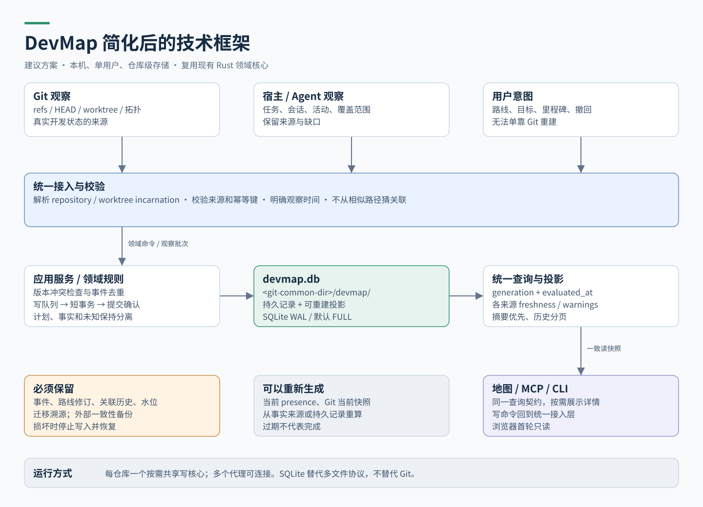

# DevMap 简化设计指导方针

日期：2026-09-08 · 状态：设计评审稿 v0.1 · 本次范围：源码研究、技术框架、技术路线图。

**建议：保留现有 Rust 核心与 Git 观察语义，以每个本地 Git 仓库一个 SQLite 数据库统一状态，通过按需启动的共享核心服务地图、MCP 和 CLI。**

这里的“一个数据库”指一个主要持久化入口。程序仍可自动管理 WAL、通信端点和进程锁；用户无需手动管理这些运行文件。目标是减少重复存储、重复采集和使用步骤，同时保留无法从 Git 重建的决策与活动历史。

## 阅读顺序

1. [CodeGraph 实现研究](01-codegraph-study.md)：按源码解释启动、索引、同步、查询及边界，区分实现事实与文档宣传。
2. [DevMap 技术框架](02-technical-framework.md)：方案比较、模块职责、数据模型、事务与恢复、接口约定。
3. [技术路线图](03-roadmap.md)：P0–P5 的交付物、前置依赖、验收门槛和停止条件。
4. [四页可编辑架构图](devmap-simplification.drawio)：用 diagrams.net / draw.io 打开，可逐个修改节点、箭头和文字。
5. [浏览版](guide.html)：同一套文档与图的离线阅读页面。

## 四张图

- [图 1：CodeGraph 的实现链路](01-codegraph.svg)
- [图 2：DevMap 建议架构](02-devmap.svg)
- [图 3：从旧存储迁移到 SQLite](03-migration.svg)
- [图 4：分阶段路线图](04-roadmap.svg)

## 六条设计准则

1. **Git 提供开发事实。** 数据库保存观察结果，不替代 Git 的提交与分支历史。
2. **人类意图必须持久保留。** 路线变更、撤回决定和无法重放的活动不得当作缓存清理。
3. **同一仓库共享存储，worktree 身份独立。** 路径相近、分支同名或任务标题相似都不能作为关联依据。
4. **一处计算，多处使用。** UI、MCP、CLI 共用领域逻辑与查询契约。
5. **自动更新必须说明边界。** 过期、缺失、观察不完整都必须可见；未观察到不等于不存在。
6. **迁移先证明等价，再切换。** 旧数据先冻结和备份，新实现通过恢复与语义检查后才接管写入。

## 研究基线与交付边界

CodeGraph 固定在 `195888d71f3ad053bfa725f24b3d3e9353c50e09`，包版本字段为 1.6.0。DevMap 固定在本地 main 的 `db696768baf366b442adf6097e0c1f4cec3f7e08`，版本字段为 0.1.1。这是源码快照，不代表远端最新版本、已安装插件或正在运行的服务。

当前工作目录位于较早的 `codex/git-workflow-orchestrator-design` 分支，不能用它的源文件代替上述 main 基线。研究通过 `git show <固定提交>:<路径>` 读取 DevMap；没有切换工作区。

本次没有安装或运行 CodeGraph，没有修改 DevMap 产品代码，没有迁移现有数据库或日志。性能数字均为待验证目标。本文档作为下一轮开发的评审输入，不表示迁移已完成或路线图已执行。

图的唯一编辑数据为 `diagrams.json`；`build_diagrams.py` 从它生成 draw.io 与 SVG。若直接在 draw.io 修改，应以导出的 draw.io 为后续源文件并重新导出 SVG，避免覆盖人工编辑。`build_preview.cjs` 生成浏览版与 PNG 检查图；`verification.json` 记录本次产物检查。
